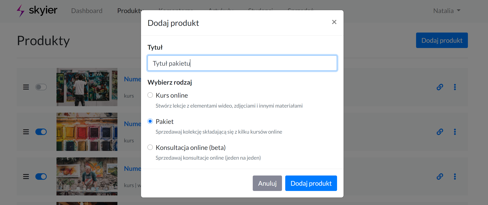

# Pakiety

Aby stworzyć pakiet składający się z 2,3,4 czy nawet większej ilości kursów wybiezr zakładkę **PRODUKTY**. 

Następnie kliknij przycisk **Dodaj produkt**. 

Podaj nazwę pakietu (tą nazwę będzie można potem zmienić) i zaznacz wariant **Pakiet**.

**Stwórz pakiet z wybranymi kursami**

Po zakupie użytkownik automatycznie otrzyma dostęp do kursów, które zostały zawarte w pakiecie. Jeśli jakiś kurs zostanie usunięty z pakietu to automatycznie student również traci do niego dostęp. Jeśli natomiast jakiś kurs zostanie dodany do pakietu, to automatycznie student zyskuje do niego dostęp.

**W skład pakietu nie wchodzi produkt, typu Konsultacje. Pakiet może składać się wyłącznie z Kursów online**. 