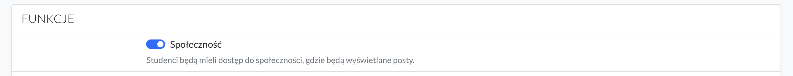
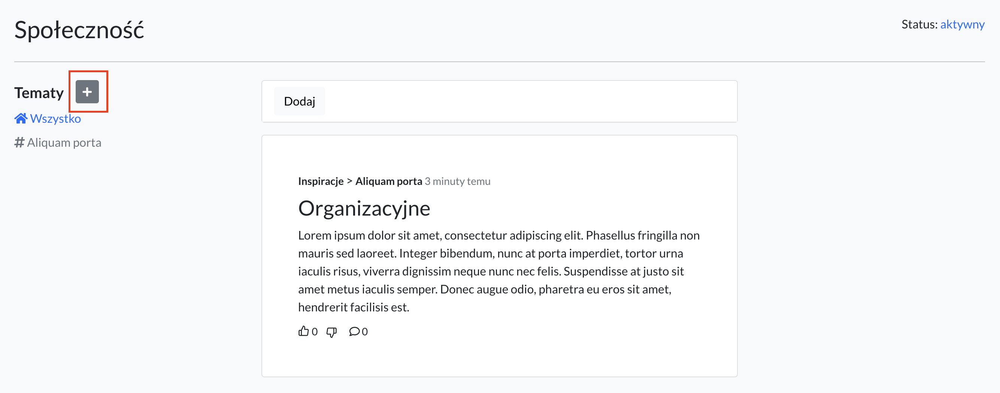
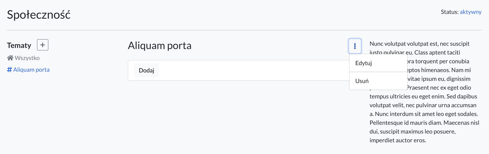
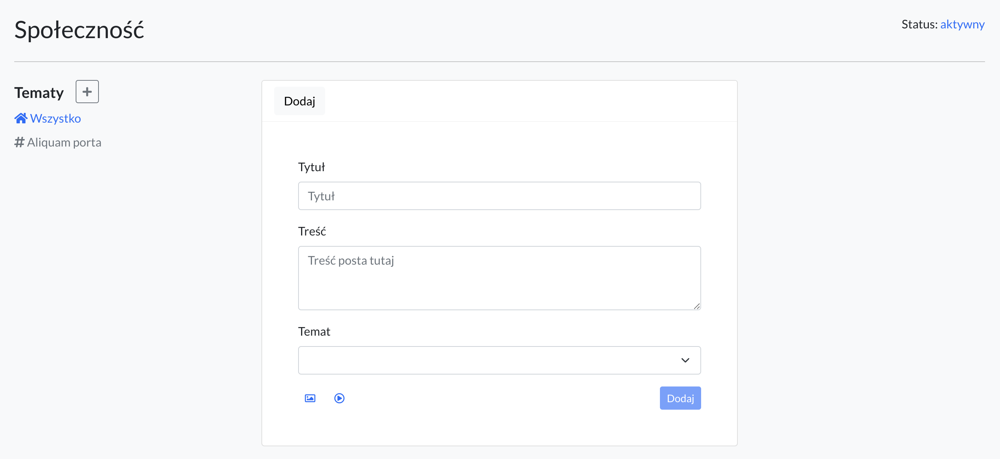
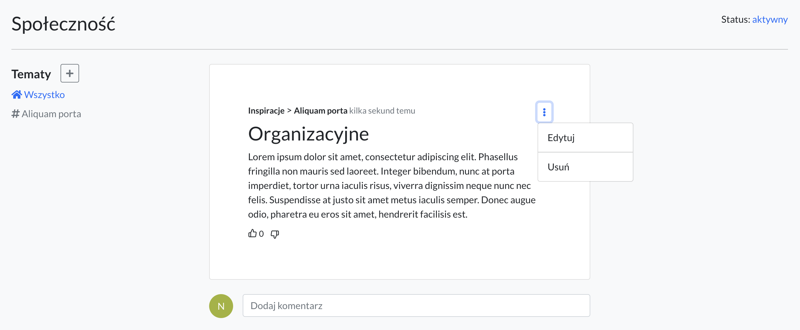
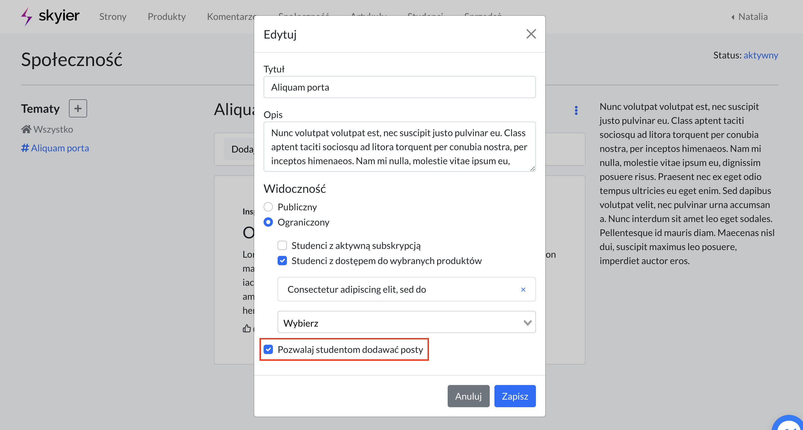
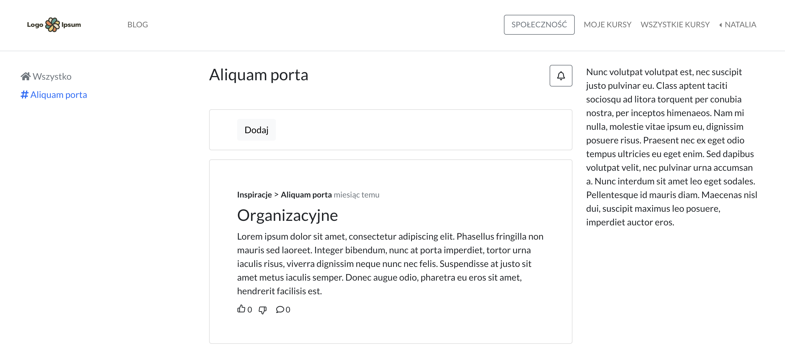

# Społeczność

## Włączenie społeczności

Aby włączyć społeczność należy wejść w **Ustawienia strony -> Funkcje i włączyć opcję Społeczności.** 

Jest to konieczne, aby posty wyświetlały się na platformie studentów. Jeśli tego nie zrobisz studenci nie będą mieli dostępu do Społeczności.

Kilka słów na temat Społeczności znajdziesz tutaj https://www.youtube.com/watch?v=xISN-Z839GA&t=10s

 

## Jak to działa? ##

W przypadku Społeczności jest możliwość tworzenia:

* **tematów**, przypisywanych konkretnym grupom odbiorców
* **postów**, w obrębie tematów. Post zawiera: tytuł, tekst, zdjęcie i link embed filmiku z YT lub Vimeo.

**Co to są tematy?**

Tematy pozwalają uporządkować informacje w różne kategorie tematyczne. Dzięki temu możesz decydować, jakie tematy powinny się wyświetlać poszczególnym grupom odbiorców. Jak z tego korzystać?

Jeśli np. masz kurs o nazwie *Jak tworzyć reklamy na Facebook'u* i chciałbyś stworzyć grupę dedykowaną tylko studentom, którzy kupili ten kurs to:

- tworzysz temat o nazwie, np. Reklamy na FB

- a następnie w opcji Widoczność -> Ograniczony, wybierasz wyłącznie kurs o nazwie *Jak tworzyć reklamy na Facebook'u* 

**Wówczas automatycznie do postów będą miały dostęp tylko osoby, które kupiły ten konkretny kurs.**

**Oczywiście możesz również stworzyć temat, który będzie dedykowany dla większej ilości grup użytkowników.** 

Jeśli np. masz dodatkowo jeszcze kurs o nazwie *Jak tworzyć reklamy na YouTube* to możesz: 

- podobnie jak w przypadku wcześniej wspomnianego kursu *Jak tworzyć reklamy na Facebook'u* stworzyć temat dedykowany wyłącznie tej grupie odbiorców.

- możesz również stworzyć temat, np. Reklamy i poblikować w nim posty, które będą się wyświetlały zarówno osobom, które kupiły kurs *Jak tworzyć reklamy na FB i Jak tworzyć reklamy na YT.* Bo pamiętaj, że dostęp do danego tematu może mieć wiele grup. Nie musisz ograniczyć się do jednej konkretnej.

 

## Tworzenie tematu

Aby stworzyć nową kategorię wybierz ikonkę **+** przy nagłówku Tematy.

A następnie podaj:
* **Tytuł kategorii**
* **Opis kategorii** - czego będzie dotyczyła, jakie tematy poruszała. Ten opis będzie też widoczny na platformie studentów.
* **Widoczność** - wybierz, dla jakiej grupy mają wyświetlać się posty dodawane w tym temacie

Możesz wybrać:
* **publiczny** - posty będą się wyświetlały dla wszystkich osób, które mają założone konto w platformie (nie muszą mieć kupionego żadnego kursu. Wystarczy, że dokonały rejestracji).
* **ograniczony** - możesz wybrać, dla jakiej konkretnie grupy mają wyświetlać się posty. Czyli np. dla osób, które mają subskrypcję czy dla osób, które kupiły konkretny kurs lub wiele kursów.

Zdecyduj, czy studenci będą mieli możliwość dodawania postów do tego tematu. 

**Tematy pozwalają wprowadzić porządek tematyczny i przypisywać różne kategorii do różnych grup odbiorców.**

 

## Edytowanie tematu

Aby edytować temat wybierz temat, który chcesz edytować.

A następnie kliknij **3 pionowe kropki**.

Wybierz **Edytuj**.

Wprowadź zmiany.

Zapisz

 

## Usuwanie tematu

Aby usunąć temat wybierz temat, który chcesz usunąć.

A następnie kliknij **3 pionowe kropki**.

Wybierz **Usuń**.

 

## Dodawanie postów

Aby dodać post należy kliknąć przycisk **Dodaj**

Podaj:
* **Tytuł posta**
* **Treść posta**
* **Załącz ewentualnie zdjęcie lub link do filmiku**

Wybierz do jakiego tematu (kategorii) ma zostać przypisany post.

 

## Edytowanie postów

Aby zmienić tytuł, treść czy zdjęcie posta kliknij w tytuł posta, który chcesz edytować.

A następnie wybierz ikonkę **3 pionowych kropek**.

Wybierz **Edytuj**

Wprowadź zmiany.

Zapisz zmiany.

 

## Usuwanie postów

Aby usunąć post, kliknij w tytuł posta, który chcesz usunąć.

A następnie wybierz ikonkę **3 pionowych kropek**.

Wybierz **Usuń**

 

## Dodawanie postów przez studentów

Możesz zdecydować, czy studenci będą mogli:

* **dodawać posty w obrębie tematów**

* **dodawać posty do wszystkich tematów czy tylko wybranych**

Jeśli chcesz umożliwić im dodawanie postów do kokretnej kategorii, wejdź w Edycję tego tematu i zaznacz opcję: *Pozwalaj studentom dodawać posty*

Wówczas odblokowana im zostanie możliwość dodawania postów tylko do tego konkretnego tematu.

