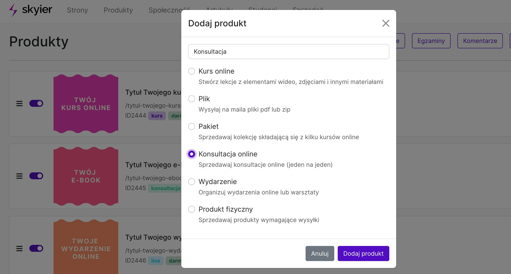
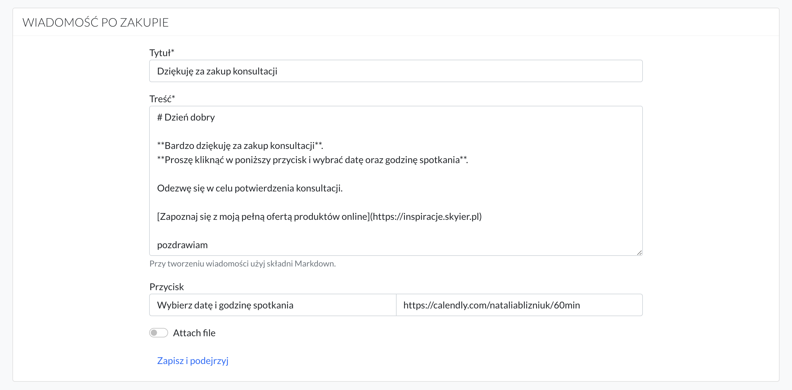
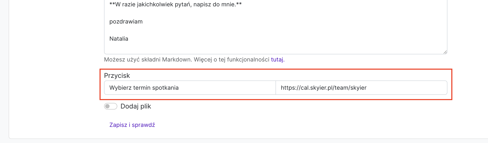
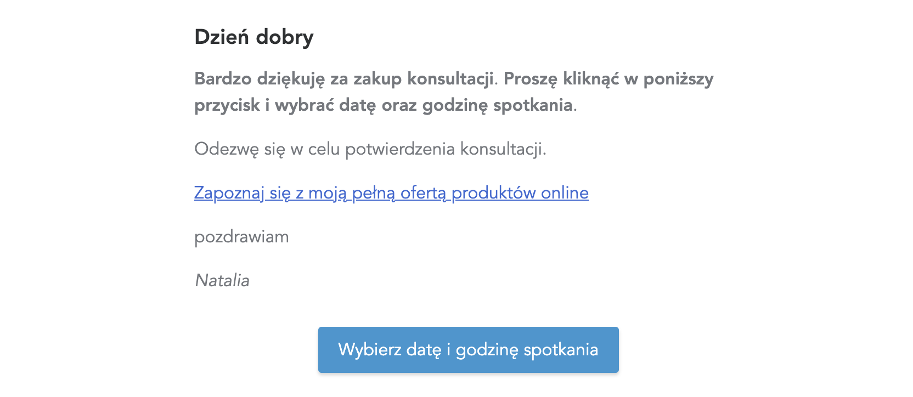

# Konsultacje

## Tworzenie konsultacji

Aby dodać konsultację wybierz w górnym menu zakładkę **PRODUKTY**.

A następnie wpisz **Tytuł**, zaznaczyć **Konsultacja online** i kliknij **Dodaj produkt**.



1. Podaj cenę za konsultację.

Więcej na temat cen, znajdziesz [tutaj](https://support.skyier.com/sales).

2. Przygotowuj **Wiadomość po zakupie**. 

Jest to wiadomość, jaką użytkownik otrzyma na maila po dokonaniu zakupu. 



Jeśli posiadasz swój kalendarz online do umawiania spotkań to w sekcji Przycisk zamieść do niego link (Google, Calendly, itp.). Aby użytkownik wybrał dogodny dla siebie termin oraz godzinę.



Jeśli jednak nie posiadasz kalendarza to możesz w treści wiadomości napisać krótką instrukcję - jak umówić się na spotkanie.

Kliknij **Zapisz i podejrzyj**. Sprawdź, czy wszystko wygląda poprawnie. 

3. Stwórz **Stronę sprzedażową**, z informacjami na temat konsultacji i z przyciskiem do zakupu. 

4. **Opublikuj produkt**. Wejdź na stronę Podukty i kliknij szary przełącznik. Kolor zmieni się na fioletowy.


<br/>

## Jak działa markdown? 

#### Nagłówki

```md
# Nagłówek 1
## Nagłówek 2
### Nagłówek 3
#### Nagłówek 4
```

#### Formatowanie tekstu

```md
**Pogrubienie**

*Kursywa*

***Pogrubienie i kursywa***

~~Przekreślenie~~
```

#### Listy

**Lista punktowana "check"**

```md
- Element 1
- Element 2
```

**Lista numerowana**

```md
1. Pierwszy punkt
2. Drugi punkt
3. Trzeci punkt
```

#### Linki

```md
[Skyier](https://skyier.com)
```

#### Obrazy

```md

```

#### Cytaty

```md
> To jest cytat.
>
> Może mieć wiele linii.
```

#### Linia pozioma

```md
---
```

Wiadomość napisana w edytorze:


Wiadomość widoczna dla użytkownika:

