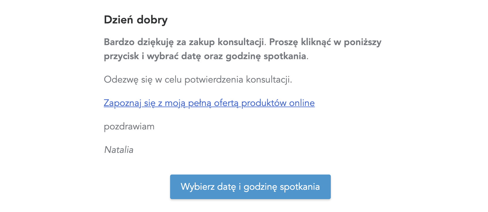

# Konsultacje

## Tworzenie konsultacji

Aby dodać konsultację wybierz w górnym menu zakładkę **PRODUKTY**.

A następnie wpisz **Tytuł**, zaznaczyć **Konsultacja online** i kliknij **Dodaj produkt**.

Podaj cenę za konsultację.

Więcej na temat cen, znajdziesz [tutaj](https://support.skyier.com/sales).

Przygotowuj **Wiadomość po zakupie**. 

Jest to wiadomość, jaką otrzyma użytkownik na maila po dokonaniu zakupu. 

Jeśli posiadasz swój kalendarz online do umawiania spotkań to zamieść do niego link (Google, Calendly, itp.). Aby użytkownik wybrał dogodny dla siebie termin oraz godzinę. Jeśli jednak nie posiadasz kalendarza to możesz w treści wiadomości napisać krótką instrukcję. 

Kliknij **Zapisz i podejrzyj**. Sprawdź, czy wszystko wygląda poprawnie. 

Stwórz **Stronę sprzedażową**, z informacjami na temat konsultacji i z przyciskiem do zakupu. 

 

## Jak działa markdown? 

Podstawowe znaczniki:

* nagłówek H1 - wstaw jeden "hasztag" przed wyrazem, np. # Dzień dobry

* nagłówek H2 - wstaw dwa "hasztagi" przed wyrazem, np. ## Dzień dobry

* nagłówek H3 - wstaw trzy "hasztagi" przed wyrazem, np. ### Dzień dobry

* **wyboldowanie** - wstaw przed i za wyrazem/zdaniem dwie gwiazdki **

* *kursywa* - wstaw przed i za wyrazem/zdaniem jedną gwiazdkę *

* [Zdanie, które chcemy podlinkować](https://www.google.com). Aby wstawić link do zdania należy w nawiasach [] wstawić zdanie, które chcemy podlinkować, a obok w nawiasach () wstawić link do strony, do której chcemy odesłać użytkownika.

Wiadomość napisana w edytorze:

Wiadomość widoczna dla użytkownika:

