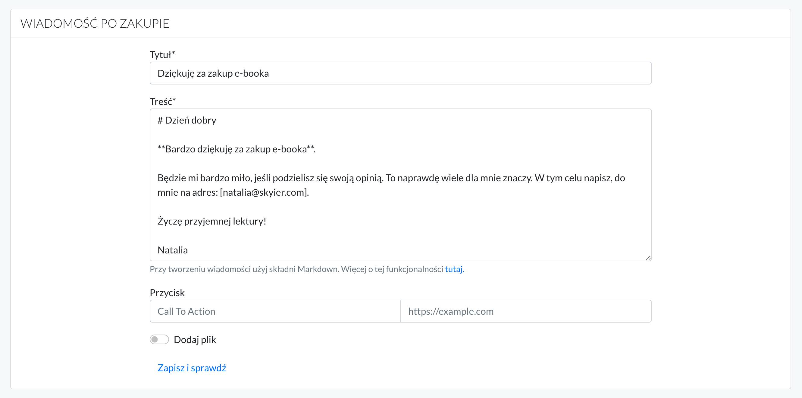
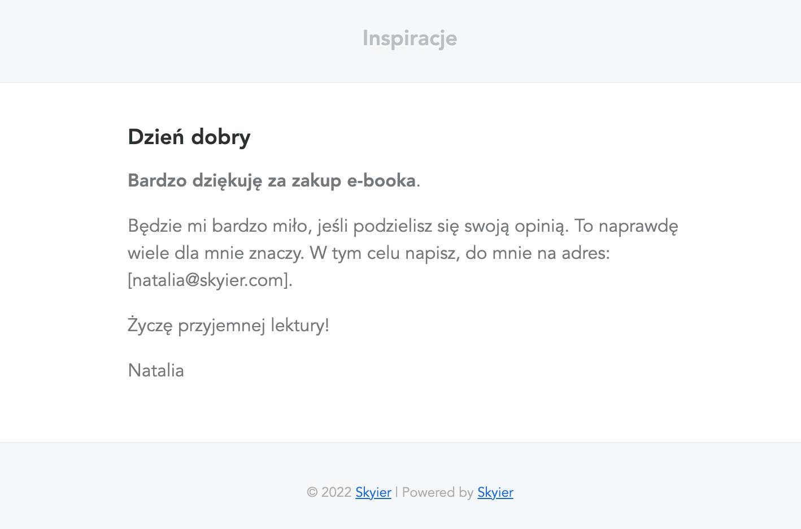

# E-booki

## Sprzedaż e-booków

Aby dodać e-book do sprzedaży wybierz w górnym menu zakładkę **PRODUKTY**.

A następnie wpisz **Tytuł**, zaznaczyć **Konsultacja online** i kliknij **Dodaj produkt**.

**Podaj cenę za produkt.**

Więcej na temat cen, znajdziesz [tutaj](https://support.skyier.com/sales).

Przygotowuj **Wiadomość po zakupie**. 

Jest to wiadomość, jaką otrzyma użytkownik na maila po dokonaniu zakupu. 
Może to być po prostu podziękowanie za zakup oraz inne dodatkowe informacje, jakie chciałbyś dodać.

**Dołącz plik, korzystają z opcji Dodaj plik.**

Kliknij **Zapisz i podejrzyj**. Sprawdź, czy wszystko wygląda poprawnie. 

Stwórz **Stronę sprzedażową**, z informacjami na temat e-booka i z przyciskiem do zakupu. 

 

## Jak działa markdown? 

Podstawowe znaczniki:

* nagłówek H1 - wstaw jeden "hasztag" przed wyrazem, np. # Dzień dobry

* nagłówek H2 - wstaw dwa "hasztagi" przed wyrazem, np. ## Dzień dobry

* nagłówek H3 - wstaw trzy "hasztagi" przed wyrazem, np. ### Dzień dobry

* **wyboldowanie** - wstaw przed i za wyrazem/zdaniem dwie gwiazdki

* *kursywa* - wstaw przed i za wyrazem/zdaniem jedną gwiazdkę

* [Zdanie, które chcemy podlinkować](https://www.google.com). Aby wstawić link do zdania należy w nawiasach [] wstawić zdanie, które chcemy podlinkować, a obok w nawiasach () wstawić link do strony, do której chcemy odesłać użytkownika.

Wiadomość napisana w edytorze.

Wiadomość widoczna dla użytkownika.
