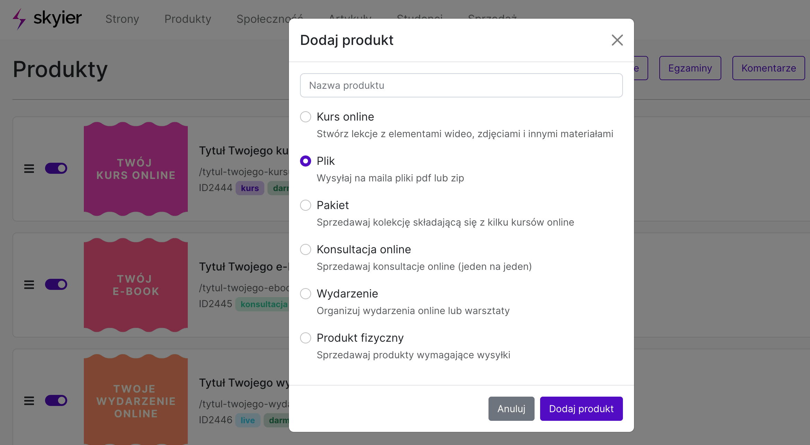
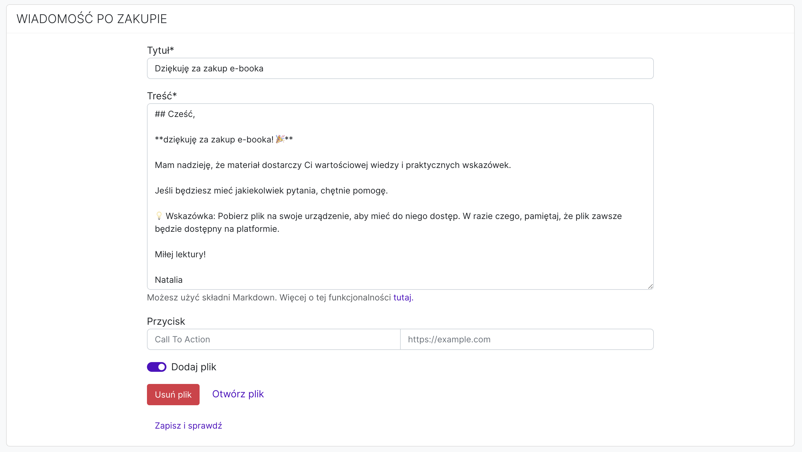
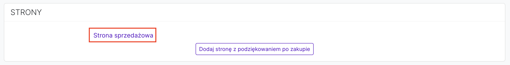
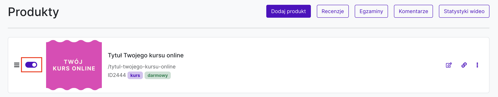
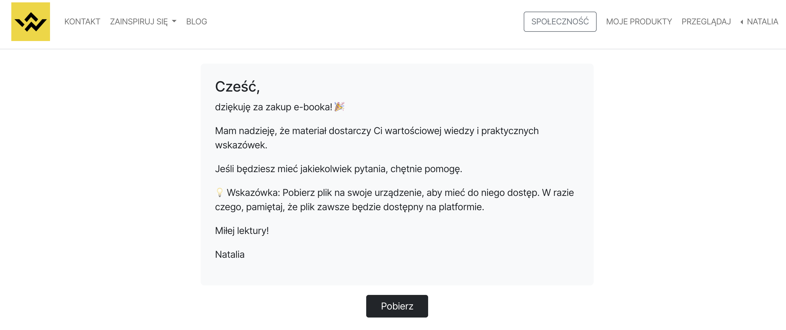
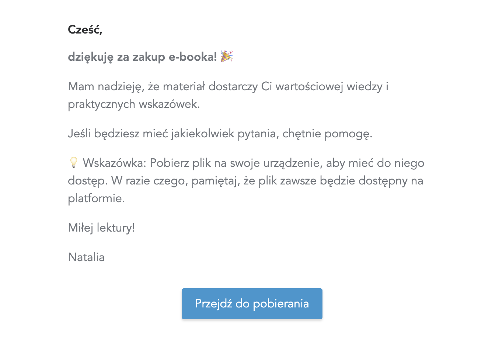

# E-book

## Sprzedaż plików

Aby dodać e-book do sprzedaży wybierz w górnym menu zakładkę **PRODUKTY**.

A następnie wpisz **Tytuł**, zaznacz opcję **Plik** i kliknij **Dodaj produkt**.

A następnie:

1. **Dodaj cenę za e-book.**

Więcej na temat cen, znajdziesz [tutaj](https://support.skyier.com/sales).

2. Przygotowuj **Wiadomość po zakupie**. 

Jest to wiadomość, jaką otrzyma użytkownik po dokonaniu zakupu. 
Może to być po prostu podziękowanie za zakup lub wiadomość wzbogacona o dodatkowe informacje, jakie chciałbyś przekazać.

3. **Dołącz plik:**

- korzystając z opcji Dodaj plik
- lub podając w polu **Przycisk** link do jego pobrania wraz z CTA, czyli wezwaniem do działania.

Kliknij **Zapisz i podejrzyj**. Sprawdź, czy wszystko wygląda poprawnie. 

Co w sytuacji, jeśli chcesz klientom udostępnić nową wersję pliku? Wtedy wystarczy, że usuniesz stary plik i dodasz nowy. Użytkownik po zalogowaniu do swojej platformy będzie miał możliwość pobrania pliku w nowej wersji. 

4. Stwórz **Stronę sprzedażową**, z informacjami na temat e-booka i z przyciskiem do zakupu. 

5. **Opublikuj produkt**. Wejdź na stronę Podukty i kliknij szary przełącznik. Kolor zmieni się na fioletowy.

 

## Jak to wygląda od strony użytkownika? 

Osoba po dokonaniu zakupu e-book:

1. Dostaje na maila wiadomość, którą przygotowałeś w kroku 2.

2. Od razu ma możliwość pobrania e-booka ze swojej platformy. 

Ten produkt dostępny jest zawsze w platformie użytkownika, po zalogowaniu. 

W momencie, kiedy udostępnisz użytkownikowi nową wersję pliku. Użytkownik będzie mógł ją pobrać właśnie w tym miejscu. 

 

## Jak działa markdown? 

Podstawowe znaczniki:

* nagłówek H1 - wstaw jeden "hasztag" przed wyrazem, np. # Dzień dobry

* nagłówek H2 - wstaw dwa "hasztagi" przed wyrazem, np. ## Dzień dobry

* nagłówek H3 - wstaw trzy "hasztagi" przed wyrazem, np. ### Dzień dobry

* **wyboldowanie** - wstaw przed i za wyrazem/zdaniem dwie gwiazdki

* *kursywa* - wstaw przed i za wyrazem/zdaniem jedną gwiazdkę

* [Zdanie, które chcemy podlinkować](https://www.google.com). Aby wstawić link do zdania należy w nawiasach [] wstawić zdanie, które chcemy podlinkować, a obok w nawiasach () wstawić link do strony, do której chcemy odesłać użytkownika.

Wiadomość napisana w edytorze.

Wiadomość widoczna dla użytkownika.
