# Integracje z narzędziami do e-mail marketingu

## Freshmail

**Gdzie znaleźć Api key i Api secret?**

1. Wybierz Ustawienia

2. W menu po lewej stronie przejdź do: API&SMTP, Wtyczki

3. Wybierz API&SMTP

4. W sekcji Twoje klucze API znajdziesz Api key i Api secret

5. Ustaw status subskrybenta:

1 - **Aktywny** - subskrybent pojawi się od razu na Twojej liście mailingowej. Nie będzie musiał potwierdzać, że chce otrzymywać maile (single opt-in). 
2 - **Do aktywacji** - subskrybent zanim pojawi się na Twojej liście mailingowej będzie musiał potwierdzić dodatkowo, że chce otrzymywać maile (double opt-in).

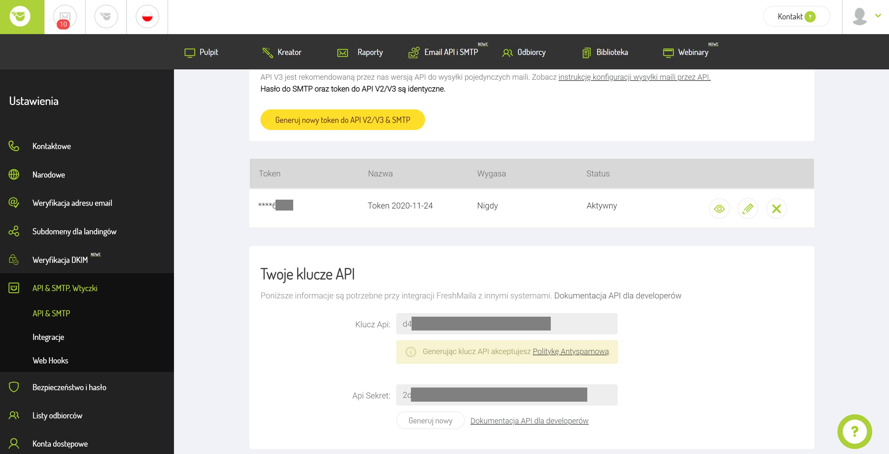

Po dokonaniu integracji, automatycznie we Freshmail'u pojawi się lista o nazwie Skyier, w której będą pojawiać się e-maile studentów.

 

## Mailchimp

**Gdzie znaleźć Api key i Audience id?**

**Aby znaleźć Api key, wybierz:**

Settings -> Account -> Extras -> API Keys -> Your API keys

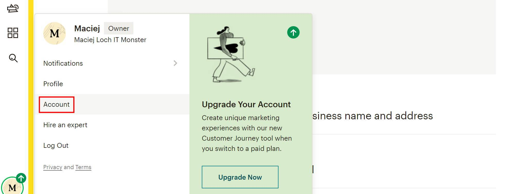

**Aby znaleźć Audience id, wybierz:**

Audience -> Audience dashboard -> Manage Audience -> View audiences

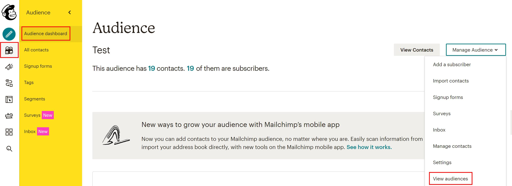

Wybierz listę -> Settings

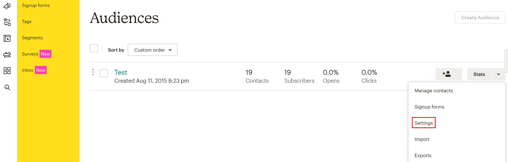

A następnie Audience name and defaults -> Audience ID (napisane czerwonym kolorem fontu)

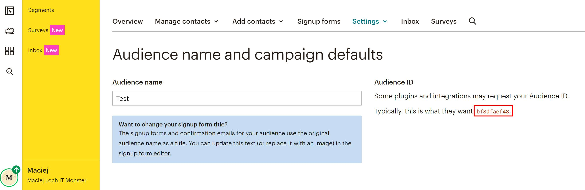

E-maile studentów będą pojawiać na liście, której Audience ID zostanie wskazane w integracji.

 

## Mailerlite

**Gdzie znaleźć Api key?**

Wybierz Ustawienia -> Integrations

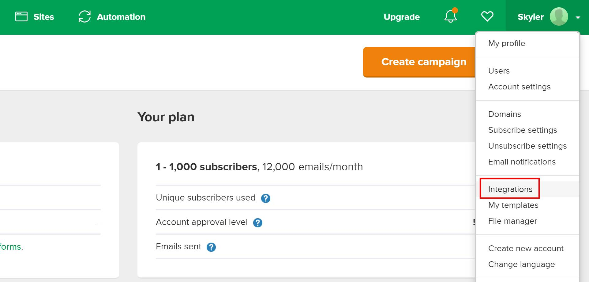

A następnie przejdź do: Developer API -> API key

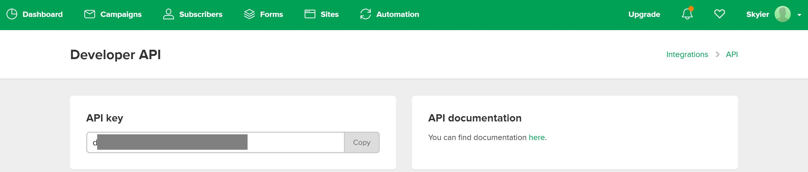

Po dokonaniu integracji, automatycznie w Mailerlite pojawi się lista o nazwie Skyier, w której będą pojawiać się e-maile studentów.

 

## GetResponse

**Gdzie znaleźć Api key i List token?**

**Gdzie znaleźć Api key?**

Wybierz Menu -> Integracje & API
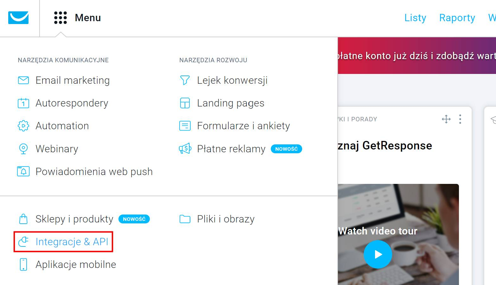

A następnie API -> Wygeneruj klucz API

**Gdzie znaleźć List token?**

Wybierz Listy -> a następnie listę, w której powinny pojawiać się e-maile studentów. Jeśli takiej listy jeszcze nie posiadasz to kliknij przycisk Utwórz listę (pamiętaj, że nazwa listy musi zawierać wyłącznie małe litery).

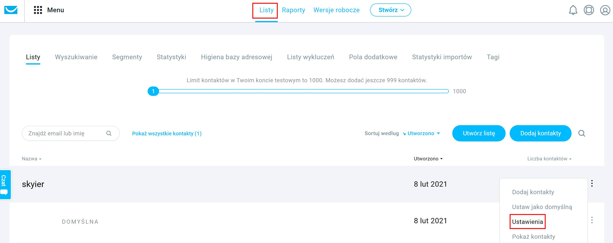

Pod nazwą listy znajduje się List token.

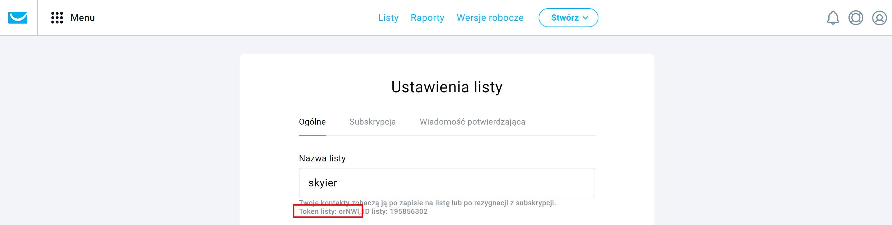

E-maile studentów będą pojawiać na liście, której token zostanie wskazany w integracji.

 

## Tagi

Lista tagów wysyłanych do narzędzi e-mail marketingu. Poszczególne tagi przypisują się automatycznie do użytkownika, w zależności od działań, jakie podejmie na platformie. 

- **registered** - wysyłany jest w momencie założenia przez użytkownika konta na platformie (czyli dokonania rejestracji). Użytkownik zakłada automatycznie konto (czyli dokonuje rejestracji) przy dokonywaniu zakupu. Ustawia się przy nim wartość 1.

- **idproduktu_checkout_started** - wysyłany jest w momencie rozpoczęcia przez użytkownika procesu zakupowego produktu online. Ścieżka użytkownika: **strona zakupowa -> wypełnienie formularza zakupowego -> kliknięcie przycisk Kupuję i płacę**. I ten ostatni krok, czyli kliknięcie przycisku Kupuję i płacę aktywuje wysłanie tego tagu. Ustawia się przy nim wartość 1.

Kliknięcie przycisku Kupuję i płacę nie daje nam gwarancji, że produkt został zakupiony. Bowiem użytkownik może zrezygnować z zakupu na etapie dokonywania płatności. Dlatego ten tag można wykorzystać do ustawienia automatyzacji odzyskiwania koszyka zakupowego. 

Każdy produkt posiada swoje indywidualne id, znaleźć je można na **liście wszystkich PRODUKTÓW**. I dzięki temu id można rozpoznać, o jaki produkt dokładnie chodzi.

Przykład: id47_checkout_started

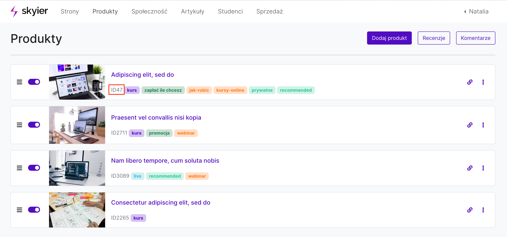

- **idproduktu** - wysyłany jest w momencie zakończenia przez użytkownika procesu zakupowego produktu online. Ustawia się przy nim wartość 1.

Dzięki temu potrafimy wyfiltrować osoby, które kupiły jakiś konkretny produkt online i wysłać do nich wiadomość.

Każdy produkt posiada swoje indywidualne id, znaleźć je można na **liście wszystkich PRODUKTÓW**. I dzięki temu id można rozpoznać, o jaki produkt dokładnie chodzi.

Przykład: id47

- **idproduktu_progress** - wysyłany jest w momencie rozpoczęcia przez uczestnika przerabiania kursu online. Przy tym tagu znaleźć można informacje, na jakim etapie (postępie) jest uczestnik.

Dzięki temu potrafimy wyfiltrować osoby, który ukończyły kurs w 100% i wysłać do nich wiadomość z gratulacjami oraz osoby, które są na początku i wysłać do nich wiadomość motywującą do działania.

Każdy produkt posiada swoje indywidualne id, znaleźć je można na **liście wszystkich PRODUKTÓW**. I dzięki temu id można rozpoznać, o jaki produkt dokładnie chodzi.

Przykład: id47_progress

- **subscription** - wysyłany jest, kiedy użytkownik dołącza do subskrypcji. Przy aktywnym subskrybencie ustawia się wartość 1, a przy osobie, która zrezygnowała z subskrypcji ustawia się wartość 0. 

Dzięki temu potrafimy wyfiltrować aktywnych subskrybentów.

- **marketing_consent** - definiuje czy użytkownik wyraził zgodę na otrzymywanie wiadomości typu newsletter czy nie. Wartość 1 oznacza, że użytkownik zaznaczył przy dokonywaniu zakupu ten checkbox i chce otrzymywać wiadomości. Wartość 0 oznacza, że nie zaznaczył przy dokonywaniu zakupu tego checkboxu i nie chce otrzymywać wiadomości.

