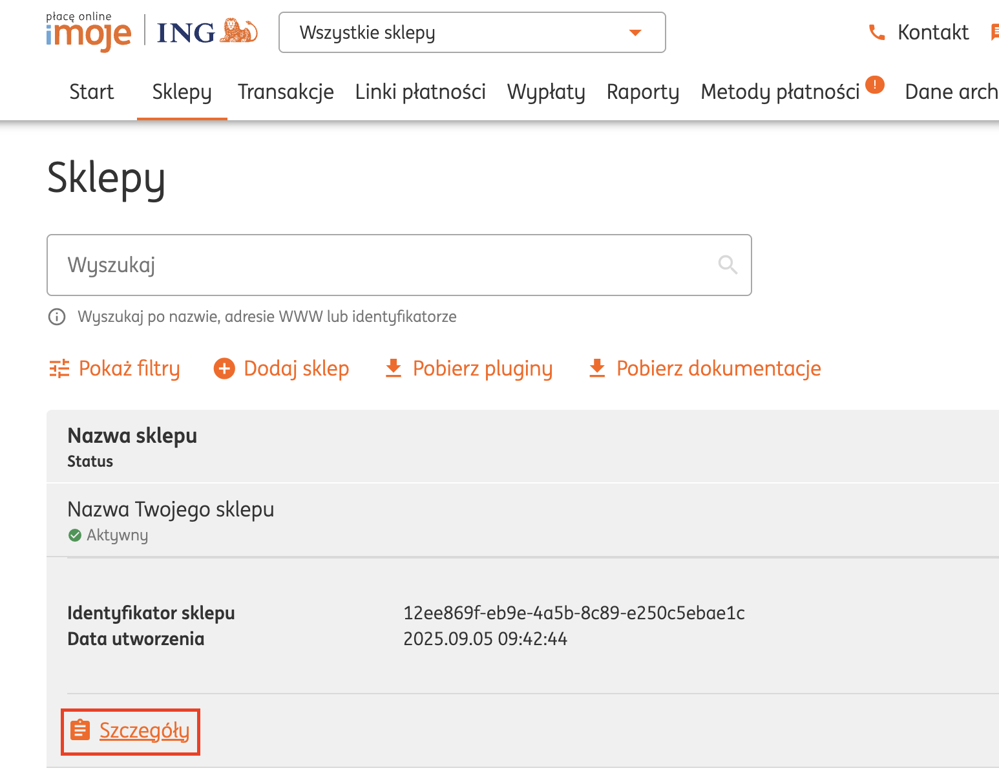
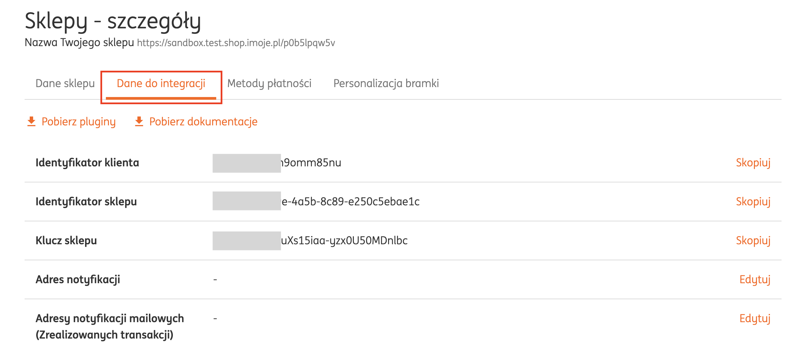

# Integracje z systemami płatności

## Przelewy24

Wybór środowiska: 
- Produkcyjne - ustawiamy, kiedy chcemy przyjmować już faktyczne płatności.
- Testowe (Sandbox) - ustawiamy, kiedy chcemy przeprowadzić płatność testową. Tryb testowy działa po aktywacji konta Sandbox w systemie Przelewy24. I dla trybu testowego obowiązuje inny klucz CRC niż dla środowiska produkcyjnego. Pamiętaj o tym, w momencie przeprowadzania płatności testowych. 

**Gdzie znaleźć ID Sprzedawcy, ID Sklepu, Klucz CRC?**

**ID Sprzedawcy** - identyfikator Twojego konta w systemie Przelewy24, który został nadany przy rejestracji w serwisie. Inaczej mówiąc, jest to numer, którym logujesz się do Przelewy24.

**ID Sklepu** - identyfikator Twojego konta w systemie Przelewy24, który został nadany przy rejestracji w serwisie. Inaczej mówiąc, jest to numer, którym logujesz się do Przelewy24. I jest on identyczny jak w przypadku ID Sprzedawcy.

**Klucz CRC** - klucz możesz pobrać w zakładce Moje dane -> Ustawienia -> Dane API i konfiguracja.

 

## Dotpay

Wybór środowiska: 
- Produkcyjne - ustawiamy, kiedy chcemy przyjmować już faktyczne płatności.
- Testowe (Sandbox) - ustawiamy, kiedy chcemy przeprowadzić płatność testową. 

**Gdzie znaleźć ID Sklepu i PIN?**

Wybierz Ustawienia -> Powiadomienia -> Konfiguracja urlc

**Numer ID Sklepu** to 6-cyfrowy numer znajdujący się przed "hasztagiem".

**PIN** to ciąg znaków przypisany do danego Sklepu.

**Dodatkowo trzeba pamiętać o ustawieniu statusu NIE w kolumnie Blokuj zewnętrzne urlc. Aby to zmienić należy wejść w Edycję sklepu i odznaczyć pole Blokuj zewnętrzne urlc.**

 

## PayU

Wybór środowiska: 
- Produkcyjne - ustawiamy, kiedy chcemy przyjmować już faktyczne płatności.
- Testowe (Sandbox) - ustawiamy, kiedy masz w PayU wybraną wersję testową i chcesz przeprowadzić płatność testową. 

**Jak dodać sklep i gdzie znaleźć Pos id, MD5, Client id, Client secret?**

Wybierz Moje sklepy -> Dodaj sklep

**Wypełnij 1 krok formularza.** Podając obowiązkowo:

- Adres strony 
- Nazwę sklepu - ta nazwa będzie widoczna na wydruku przelewu

W przypadku adresu strony (jeśli nie masz go jeszcze dodanego) wybierz opcję inny adres, a następnie wypełnij formularz, który się pojawił.

W polu **Inny adres www** wybierz: https:// i podaj adres url swojej platformy. Przykład: https://inspiracje.skyier.pl

Uzupełnij inne obowiązkowe pola.

**Przejdź do kroku drugiego kroku**

- wybierz Typ punktu płatności: REST API (checkout)
- podaj Nazwę punktu płatności

Kliknij przycisk **Dodaj sklep**. Pojawią Ci się dane, które należy wpisać w Skyier.

**Gdzie znaleźć Pos id, MD5, Client id, Client secret? - kiedy masz już dodany sklep**

Wybierz Płatności elektroniczne -> Moje sklepy -> Punkty płatności wybranego sklepu

Wybierz ponownie Punkt płatności i przejdź do szczegółówych informacji, na jego temat.

 

## PayPal

Wybór środowiska: 
- Produkcyjne - ustawiamy, kiedy chcemy przyjmować już faktyczne płatności.
- Testowe (Sandbox) - ustawiamy, kiedy chcemy przeprowadzić płatność testową. 

**Gdzie znaleźć Secret i Client ID?**

Wejdź na stronę https://developer.paypal.com/home i zaloguj się do panelu

Wybierz Dashboard -> My Apps & Credentials -> Live -> Create App

Podaj nazwę App, aby wiedzieć, w jakim celu została utworzona -> Create App

 

## TPay

#### Jeśli prowadzisz sprzedaż wyłącznie pojedynczych produktów (kursów online, pakietów, konsultacji) to wypełnij pola: ID Sprzedawcy, Kod bezpieczeństwa, Klucz API i Hasło API.

**Gdzie znaleźć ID Sprzedawcy i Kod bezpieczeństwa?**

**ID Sprzedawcy** to identyfikator Twojego konta w systemi TPay. Inaczej mówiąc jest to numer, którym logujesz się do panelu TPay.

**Kod bezpieczeństwa znajdziesz:** Menu -> Ustawienia -> Powiadomienia -> Zabezpieczenia.

**Klucz API i Hasło API znajdziesz:** Menu -> Integracja -> API.

Kliknij przycisk DODAJ NOWY KLUCZ 

A następnie utwórz hasło, aktywuj go i wybierz rodzaj uprawnienia. Po dodaniu klucza automatycznie zostanie wygenerowany klucz, który trzeba podać w integracji w Skyier.

#### Jeśli prowadzisz sprzedaż subskrypcyjną kursów to dodatkowo wypełnij pola: Klucz API, Kod weryfikacyjny, Hasło API, Klucz publiczny RSA, Algorytm podpisu.

**Gdzie znaleźć te informacje?**

Wejdź w Menu -> Płatności kartami -> API

Przy pierwszej konfiguracji tej strony trzeba wygenerować Kod weryfikacyjny i ustawić Hasło API.

W przypadku:

**- Adresu url powiadomień - podaj: https://nazwadomeny.pl/api/tpay/subscription/notify**

**- Adres url powrotny (powodzenia i błąd) - podaj nazwę strony, czyli: https://nazwadomeny.pl**

 

## Stripe

**Gdzie znaleźć Publishable Api Key, Secret Api Key i Webhook Singing Secret?**

Publishable Api Key i Secret Api Key znajdziesz: Developers -> API keys -> Standard keys

Aby poznać Secret key kliknij *Reveal live key*

Aby ustawić Webhook Singing Secret należy najpierw ustawić Endpoint. Aby to zrobić przejdź do: Developers -> Webhooks -> Add endpoint.

Następnie w polu

**- Url endpoint** podaj adres url, który ma taką strukturę: nazwadomeny.pl/api/stripe/notifications

**- w Events to send wybierz:** receive all events

**Kliknij Update endpoint**

**Webhook Singing Secret znajdziesz:** Developers -> Webhooks -> wybrany Endpoints (kliknij adres url, który stworzyłeś we wcześniejszym kroku) -> Signing Secret.

Aby poznać Webhook Signing Secret kliknij *Reveal live key*

Sprawdź, czy Webhook ma status: **active**.

 

## Paynow

Jeśli nie masz aktywowanej na swoim koncie bankowym platności Paynow to w pierwszym kroku złóż wniosek. 

**Aby to zrobić, zaloguj się w mbanku na swoje konto biznesowe, a następnie wybierz: Mój Biznes -> Paynow -> Aktywuj.**

Dopiero po aktywacji będziesz mógł przejść do wprowadzenia poniższych ustawień.

Wybór środowiska: 
- Produkcyjne - ustawiamy, kiedy chcemy przyjmować już faktyczne płatności.
- Testowe (Sandbox) - ustawiamy, kiedy chcemy przeprowadzić płatność testową. 

**Gdzie znaleźć Klucz API i Signature Key?**

Wybierz Mój Biznes -> Ustawienia -> Sprzedaż -> Sklepy i punkty płatności

Kliknij Dodaj sklep

I podaj następujące dane:

* **domena sklepu** - url Twojej platformy z kursami online, np. https://inspiracje.skyier.pl
* **kategoria sklepu** - wybierz kategorią, która najlepiej odpowiada tematyce Twojej platformy
* **platforma sklepowa** - wybierz: Własna platforma

Dodaj sklep

Ustaw:

* **adres powiadomień** - ma on strukturę: https://twojadomena/api/paynow/notify

* **adres powrotu** - ma on strukturę: https://twojadomena/transaction/pending

A następnie skopiuj i podaj w Skyier:

* **Klucz dostępu do API** -> Klucz API

* **Klucz obliczania podpisu** -> Signature Key

 

## Imoje

Wybór środowiska: 
- Produkcyjne - ustawiamy, kiedy chcemy przyjmować już faktyczne płatności.
- Testowe (Sandbox) - ustawiamy, kiedy chcemy przeprowadzić płatność testową. 

**Jak dodać sklep i gdzie znaleźć Identyfikator klienta, Identyfikator sklepu, Klucz sklepu?**

Wybierz Sklepy -> Dodaj sklep

Wypełnij formularz. **Podając obowiązkowo:**

* Nazwę sklepu
* Adres url platformy

Sklep pojawi się na liście Twoich sklepów. Kliknij w niego, a następnie wybierz opcję **Szczegóły**.

Przejdź do zakładki **Dane do integracji**

Skopiuj i wklej do integracji w Skyier nastepujące dane: 
* Identyfikator klienta
* Identyfikator sklepu
* Klucz sklepu

Ostatnim krokiem jest ustawienie adresu notyfikacji. Aby to zrobić kliknij Edytuj w polu Adres notyfikacji. 

I wpisz adres o strukturze: https://nazwa-platfomy.pl/api/imoje/notify

