# Live

### Ustawienia na YouTube

**Aby zorganizować transmisję online za pomocą YouTube musisz posiadać konto na YouTube i mieć aktywowaną możliwość organizowania transmisji na żywo. Jeśli nigdu wcześniej nie aktywowałeś tej opcji to zrób to teraz. Bo YouTube włączy Ci tą funkcję w przeciągu 24 h.**

W momencie, kiedy masz już dostęp do organizowania Transmisji na żywo:

Kliknij opcję **Transmituj na żywo**

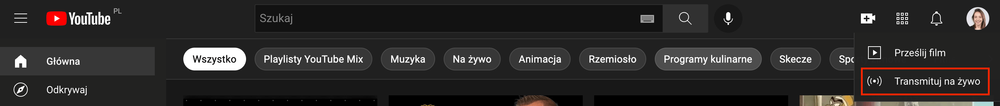

Wybierz, kiedy chcesz rozpocząć wydarzenie online: **teraz czy wolisz je zaplanować**.

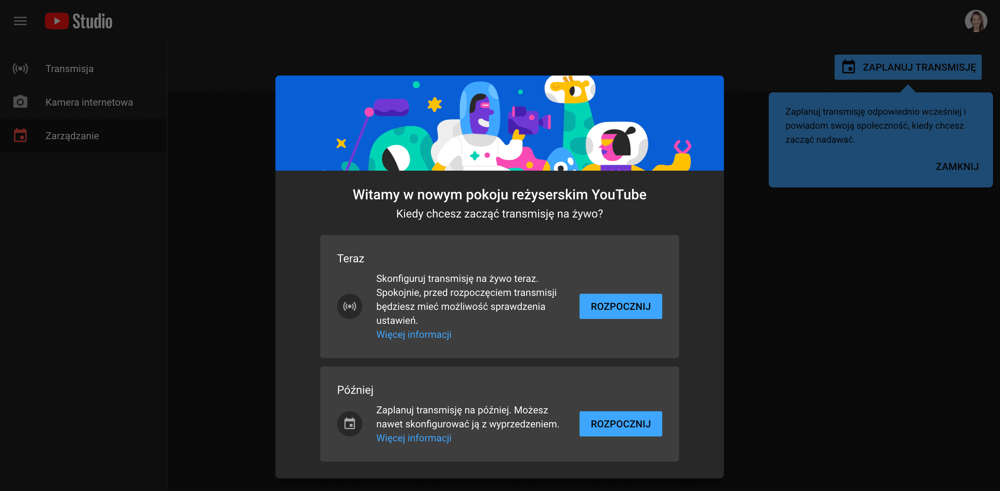

Wybierz tryb transmisji:

* **wbudowana kamera internetowa** - jest opcja zalecana dla osób początkujących. Łatwiejsza do zastosowania na początek.
* **oprogramowanie do transmisji na żywo** - możesz transmisję na żywo przeprowadzić dodatkowo za pomocą zewnętrznego oprogramowania do przechwytywania audio i wideo, typu OBS czy StreamYard. 

Te zewnętrzne oprogramowania (OBS czy StreamYard) dają Ci możliwość pokazania prezentacji czy przeprowadzenie wydarzenia z innymi osobami. Jeśli natomiast chcesz przeprowadzić wydarzenie w formie "gadająca głowa" Twoja wbudowana kamerka w laptop jest wystarczająca.

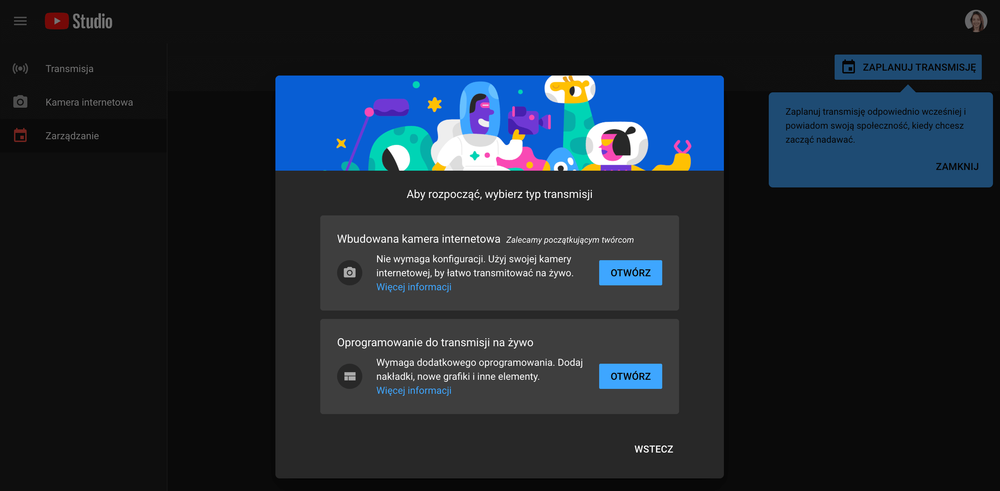

Podaj wymagane informacje na temat wydarzenia online.

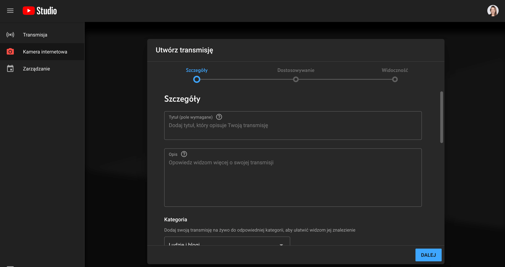

Przy ustawianiu Widoczności rekomendujemy wybranie opcji: Niepubliczne. Dzięki czemu tylko osoby, które otrzymają link będą mogły wziąć udział w transmisji.

Po podaniu wszystkich informacji kliknij przycisk udostępnij. 

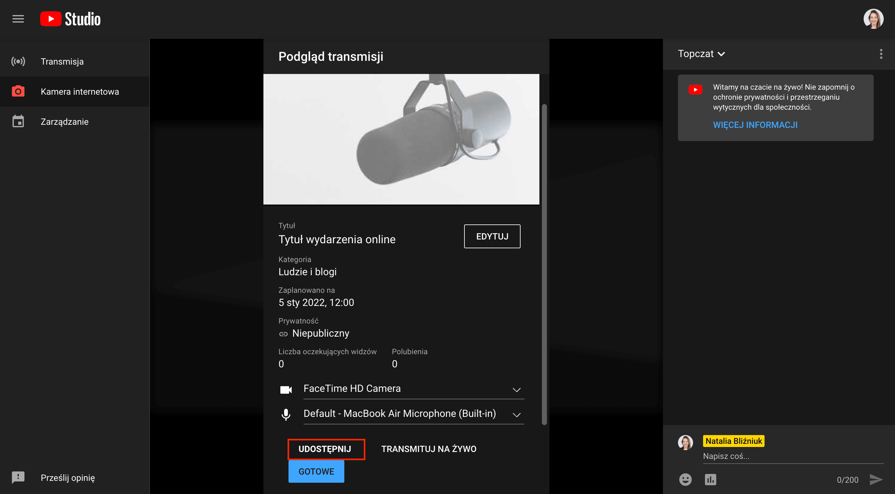

I skopiuj link, który pojawi się w oknie.

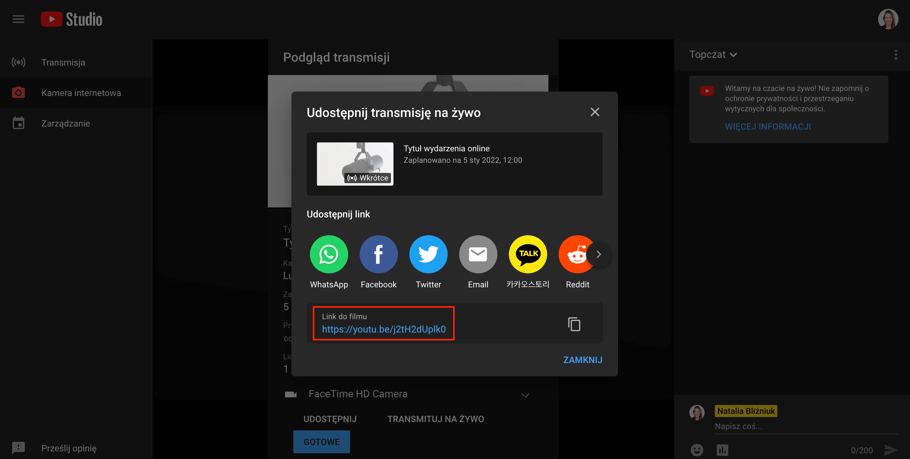

Otwórz link w nowym oknie. Wybierz ponownie opcję Udostępnij -> Umieść.

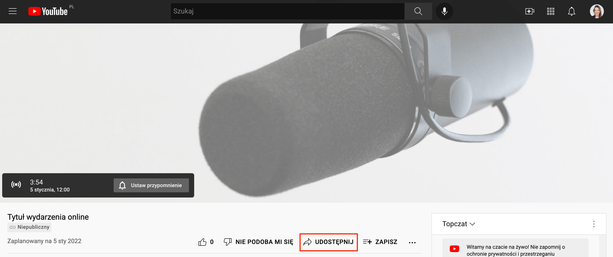

I z kawałka kodu, który pojawił się po prawej stronie, skopiuj link. I ten właśnie link będzie Ci potrzebny do umieszczenia w Skyier. 

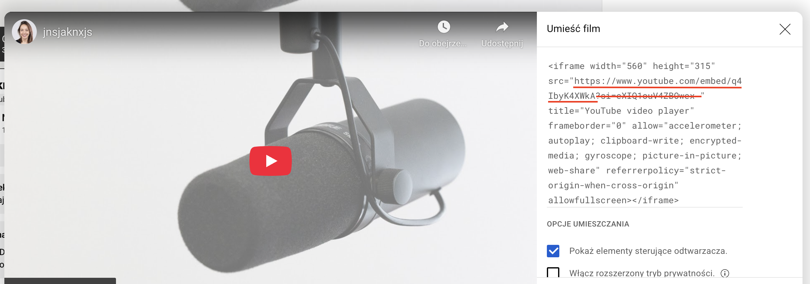

### Ustawienia w Skyier

Po zalogowaniu utwórz produkt typu live. Aby to zrobić przejdź do **PRODUKTY -> Dodaj -> podaj tytuł live i wybierz wariant Wydarzenie**.

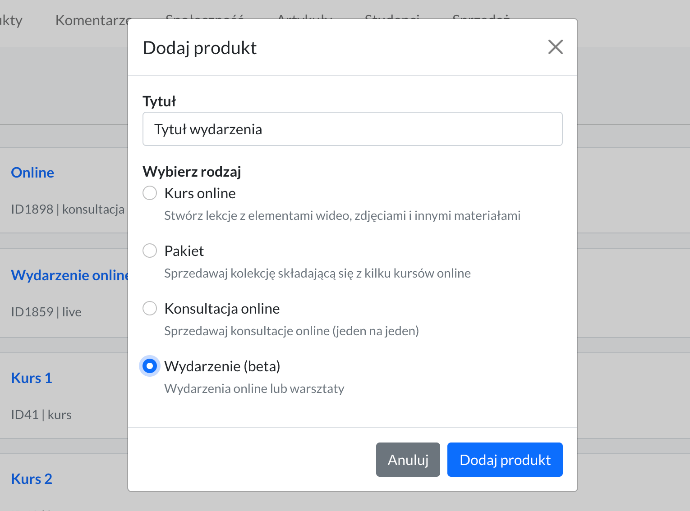

Teraz możesz ewentualnie zmienić tytuł live i uzupełnić opis Wydarzenia. Możesz wpisać kilka słów na temat tego, czego będzie ono dotyczyło. Potraktuj to jako miejsce na tzw. lead (zajawkę). A nie opis całego wydarzenia. Opis całego wydarzenia zalecam zrobić na stronie sprzedażowej.

W sekcji WYDARZENIE podaj:

* **datę rozpoczęcia i godzinę** - jeśli ustawisz te informacje na stronie z wydarzeniem automatycznie pojawi się odliczanie czasu do momentu rozpoczęcia. 

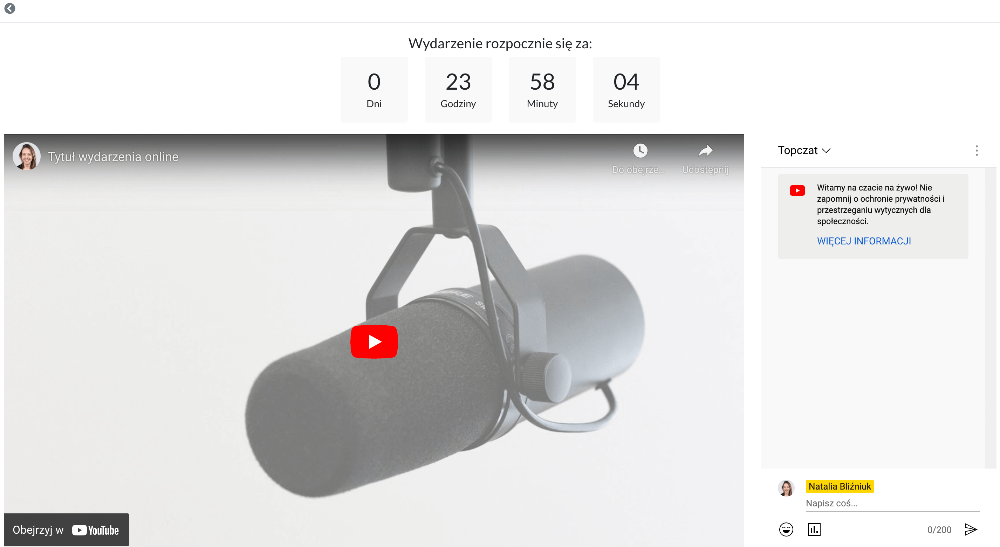

* **redirect url** - tutaj wprowadź link do webinaru, na jaki mają zostać przekierowani uczestnicy. Jeśli przykładowo organizujesz webinar na Zoom'ie dodaj w tym miejscu link do pokoju webinarowego stworzonego właśnie na Zoom'ie. W momencie, jak użytkownicy zalogują się do platformy w celu oglądania webinaru -> po kliknięciu w produkt zostaną przekierowani bezpośrednio do oglądania webinaru na Zoom'ie. Czyli "wyjdą" z platformy i przejdą bezpośrednio na webinar. 

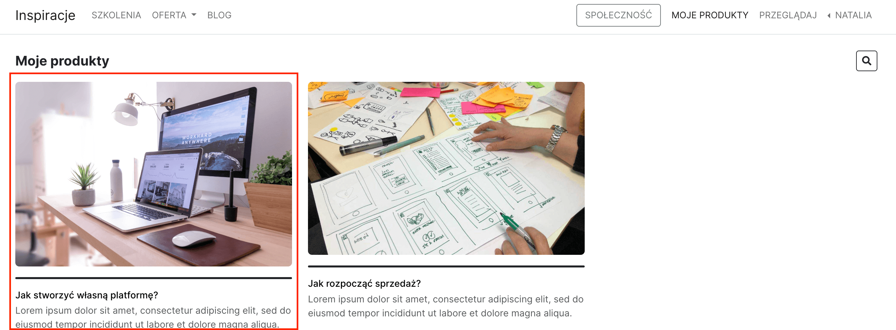

* **video embed url** - tutaj wprowadź ten link, który pobrałeś wcześniej z YouTube. 
Będzie to link w takiej postaci: https://www.youtube.com/embed/j2tH2dUplk0. Oczywiście w Twoim wypadku będą inne te cyferki na końcu. Co ważne nie dodawaj cyferek, które są po znaku "?si". 
* **chat embed url** - jeśli chcesz dodatkowo dodać czat dodaj tam link w takiej postaci:
https://www.youtube.com/live_chat?v=TWOJE-CYFERKI-ZE-WCZESNIEJSZEGO-LINKU&embed_domain=TWOJA-NAZWA-DOMENY. Co ważne nie dodawaj cyferek, które są po znaku "?si".

Możesz zrobić wydarzenie, jako:
* **darmowe** - wówczas, jeśli użytkownik chce je obejrzeć będzie musiał założyć konto na platformie (jeśli jeszcze nie posiada). 
* **płatne** - użytkownik który zakupi dostęp będzie mógł wziąć udział w wydarzeniu. Wówczas w dniu webinaru będzie musiał zalogować się do platformy.

Więcej na temat cen, znajdziesz [tutaj](https://support.skyier.com/sales).

Jeśli natomiast chcesz zostawić dodatkowe informacje osobom zapisanym na webinar wówczas użyj funkcji: **Pokaż dodatkową wiadomość**. Ta wiadomość będzie wyświetlana od momentu, kiedy ją dodasz, do momentu, kiedy ją skasujesz. 

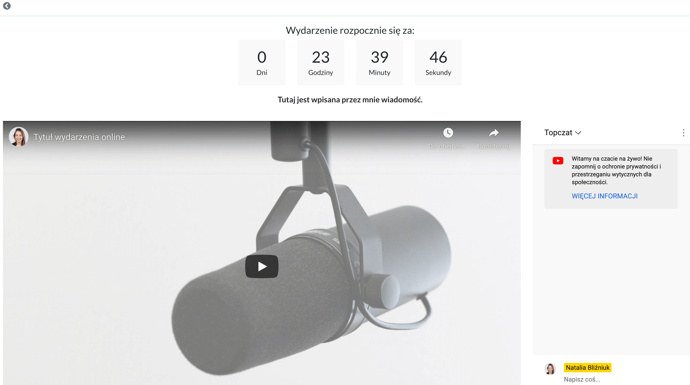

**Ważne** Po zakończeniu transmisji YouTube automatycznie nagra Ci wideo. Wideo to będzie również dostępne w platformie. Jeśli nie chcesz, aby była możliwość jego późniejszego oglądania to usuń to wideo z YT lub usuń ze Skyier embed url. 

### Przekształć w kurs online

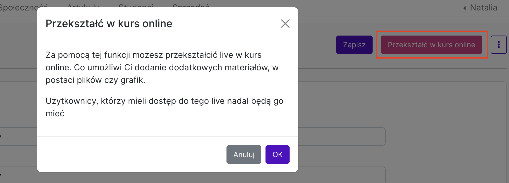

Skorzystaj z tej opcji, jeśli chcesz nadal sprzedawać dostęp do tego szkolenia online. I dodatkowo dodać do niego materiały, takie jak prezentacja, pliki, grafiki, itp. 

Osoby, które wykupiły dostęp do tego live'a po **Przekształceniu tego produktu w kurs online nadal będą miały do niego dostęp.** I dodatkowo otrzymają dostęp do materiałów, które do niego dodasz. 

Zmieni się też widok panelu oglądania od strony uczestnika. Panel "webinarowy" zamieni się na panel "kursu online". Czyli taki, jak widać poniżej. 

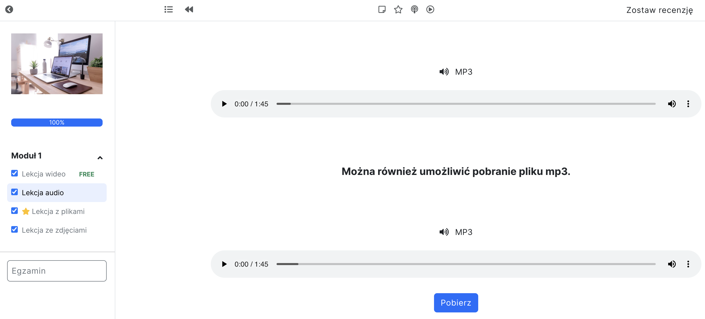