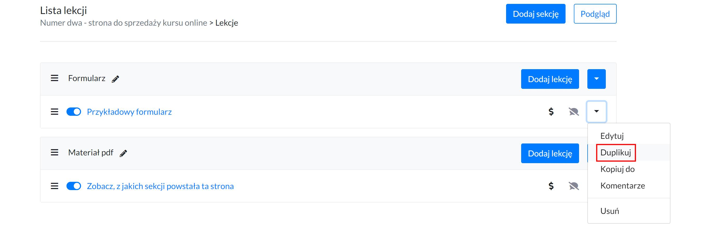

# Kursy

## Tworzenie kursu

Przejdź do zakładki **PRODUKTY.**

Następnie kliknij przycisk **Dodaj produkt.**

**Wpisz tytuł produktu.** Tytuł będzie można później zmienić.

Kliknij **Dodaj produkt.**

 

### Informacje podstawowe

* **tytuł** - tytuł kursu. To pole jest wymagane.
* **URL** - nazwa, jaka będzie zawarte w adresie URL. Ta nazwa tworzy się automatycznie na podstawie tytułu podanego we wcześniejszym kroku. Jeśli zmienisz nazwę kursu to potem możesz też zmienić nazwę adresu url. To pole jest wymagane.
* **opis** - kilka zdań na temat kursu online. To pole nie jest wywmagne.
* **poziom trudności** - możesz określić poziom trudności swojego kursu, aby użytkownicy wiedzieli, czy ten kurs jest dla nich. To pole nie jest obowiązkowe.
* **obraz**  - wgrane zdjęcie będzie widoczne na Liście wszystkich kursów oraz na stronie płatności (checkout).

 

## Publikacja kursu 

Aby opublikować kurs należy kliknąć szary przełącznik. **Po kliknięciu kolor zmieni się na niebieski,** co oznacza, że kurs został opublikowany. 

Nieopublikowany kurs **nie będzie widoczny na LIŚCIE KURSÓW na stronie głównej,** ani w panelu nauki studenta w zakładce WSZYSTKIE KURSY. 

Jeśli jednak kurs zostanie odpublikowany po tym, jak użytkownik go kupił. To uczestnik kursu dalej będzie miał do niego dostęp i będzie on widoczny na jego platformie w zakładce MOJE KURSY. 

 

## Duplikowanie kursu

Aby zduplikować kurs należy wybrać **Duplikuj** przy opcjach kursu. 

Zduplikowany kurs pojawi się na dole listy.

**Duplikacja kursu duplikuje: stronę sprzedażową oraz listę lekcji.** 

 

## Ustawianie kursu jako darmowy

Aby ustawić kurs jako darmowy należy wejść w **Edycję kursu.**

Następnie przejść do sekcji **CENA** i zaznaczyć opcję *Kurs jest darmowy.* 

**Na przycisku (zamiast call to action KUPUJĘ TERAZ ZA...) pojawi się call to action OGLĄDAJ TERAZ.** 

 

## Ustawianie kursu jako możliwego do obejrzenia po zostawieniu adresu e-mail.

Aby ustawić kurs jako darmowy należy wejść w **Edycję kursu.**

Następnie przejść do sekcji **CENA** i zaznaczyć opcję *Produkt jest darmowy oraz Uczestnicy muszą się zalogować do platformy, aby móc objerzeć kurs za darmo.*

**Na przycisku (zamiast call to action DOŁĄCZ DO KURSU) pojawi się call to action OGLĄDAJ TERAZ.** 

Po kliknięciu w przycisk **OGLĄDAJ TERAZ** użytkownik przejdzie do rejestracji/logowania w celu otrzymania dostępu do kursu.

 

## Ustawianie dostępu czasowego do kursu 

Aby ustawić określony czas dostępu do kursu należy wejść w **Edycję kursu.**

Następnie przejść do sekcji **SZCZEGÓŁY** i wpisać przez ile dni kurs ma być dostępny dla studenta po zakupie.

**0 - oznaczania nieograniczony dostęp.** 

 

## Tworzenie lekcji

Przejdź do Listy lekcji.

Stwórz plan swojego kursu. Rozpisując go na sekcje i lekcje.

Wybierz komponenty, z jakich będzie składała się lekcja (TEKST, WIDEO, PLIK, itd.), a następnie przesuń je na prawą stronę.

Twoje lekcja może składać się z wielu komponentów. Komponenty też mogą się powtarzać (można wybrać np. dwa razy TEKST czy 3 razy PLIK).

W przypadku PLIKU można wgrać mp3, pdf, doc, docs, xls, xlsx. 

 

## Publikacja lekcji

Aby opublikować lekcję należy kliknąć szary przełącznik. **Po kliknięciu kolor zmieni się na niebieski,** co oznacza, że lekcja została opublikowana.  

Nieopublikowane lekcje nie są widoczne dla uczestnika kursu.  

 

## Duplikowanie lekcji w tym samym kursie

Aby zduplikować lekcję należy wejść na **Listę lekcji**.

A następnie przy wybranej lekcji wybrać opcję *Duplikuj*.

Zduplikowana lekcja pojawi się na końcu sekcji.

 

## Kopiowanie lekcji do innego kursu

Aby skopiować lekcję należy wejść na **Listę lekcji**.

A następnie przy wybranej lekcji wybrać opcję *Kopiuj do*.

I wybrać kurs, do którego chcemy skopiować lekcję. 
Skopiowana lekcja pojawi się na Liście lekcji kursu, do którego została skopiowana. 

 

## Ustawienie lekcji jako darmowej

Aby ustawić wybraną lekcją jako darmową do obejrzenia należy wejść w **Listę lekcji.**

Następnie kliknąć w ikonkę **$ i user+**. Wówczas ikonki zmienią się na ikonki **user- i prezent**. Co będzie oznaczało, że lekcja będzie dostępna za darmo, bez konieczności logowania.

Na liście lekcji (pod warunkiem, że na stronie sprzedażowej zostanie dodany komponent LISTA LEKCJI), pokaże się call to action *Oglądaj za darmo*, po kliknięciu, w który użytkownik przejdzie do obejrzenia lekcji. 

 

## Ustawienie lekcji jako możliwej do obejrzenia po zostawieniu e-mail

Aby ustawić wybraną lekcją jako darmową do obejrzenia należy wejść w **Listę lekcji.**

Kliknąć w ikonkę **$, a następnie user-**. Wówczas ikonki zmienią się na ikonki **user+ i prezent**. Co będzie oznaczało, że lekcja będzie dostępna po zalogowaniu.

Na liście lekcji (pod warunkiem, że na stronie sprzedażowej zostanie dodany komponent LISTA LEKCJI), pokaże się call to action *Oglądaj za darmo*, po kliknięciu, w który użytkownik będzie musiał zalogować się, aby przejść do obejrzenia lekcji. 

 

## Opóźnianie lekcji

Aby włączyć opóźnienia lekcji, należy przejść do **Listy lekcji**. 

A następnie na poziomie sekcji wybrać opcję *Opóźnienie sekcji*.

I podać, po **ilu dniach od zakupu** ma być dostępna sekcja z lekcjami. 

**Opóźnienie ustawia się na poziomie całej sekcji, a nie poszczególnych lekcji.** Jeśli chcesz, aby opóźnienie dostępu następowało na każdej lekcji, wówczas każda lekcja powinna być w oddzielnej sekcji. 

**I co ważne, opóźnienie odbywa się w stosunku do dnia zakupu kursu.**

Jeśli ustawisz opóźnienie drugiej sekcji o 2 dni, a opóźnienie trzeciej seksji o 4 dni. To w momencie, kiedy użytkownik kupi kurs 23 czerwca to od razu po zakupie będzie miał dostęp do pierwszej sekcji, 25 czerwca do drugiej, a 27 czerwca do trzeciej. 

## Cena

Więcej na temat cen, znajdziesz [tutaj](https://support.skyier.com/sales).
 