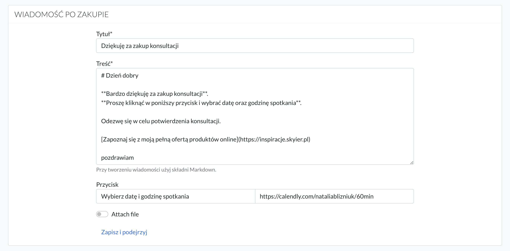

# Inne ustawienia

## Leady

Aby zacząć zbierać leady (adresy e-mail) należy na **stronie sprzedażowej dodać komponent ZBIERANIE LEADÓW.**

Wówczas na stronie pojawi się **krótki formularz, z polami: e-mail i imię.** 

Statystyki na temat ilości zebranych leadów można znaleźć **w zakładce Leady.** 

**Komponent ZBIERANIE LEADÓW można dodać tylko na stronach sprzedażowych.**

Jeśli natomiast chcesz zbierać leady również na stronie głównej to należy stworzyć formularz w swoim narzędzie do e-mail marketingu (MailerLite, GetResponse, itp.), a następnie zaembedować kod za pomocą komponentu HTML. 

 

## Komentarze

Aby włączyć możliwość dodawania komentarzy pod lekcję należy przejść do **Listy lekcji**.

A następnie przy wybranej lekcji kliknąć **ikonkę "komentarza".** Wówczas szara przekreślona ikonka zmieni się na czarną ikonkę bez przekreślenia. To oznacza, że możliwość dodawania komentarzy została włączona. 

Aby otrzymywać na maila powiadomienia o nowych komentarzach należy przejść do **Ustawień strony -> Powiadomienia** -> i zaznaczyć opcję *Chcę otrzymywać powiadomienia o nowych komentarzach.* 

Aby sprawdzić wszystkie swoje komentarze, należy wybrać zakładkę **KOMENTARZE** w górnym menu. 

 

## Blog

Aby włączyć możliwość dodawania artykułów należy przejść do **Ustawień strony -> Funkcje, a następnie włączyć opcję:** *Włącz funkcję dodawania artykułów.* 

Nazwa, którą podasz będzie widoczna w górnej nawigacji. Może to być na przykład Blog.

Następnie wybierz w górnym menu zakładkę **ARTYKUŁY**

Kliknij w przycisk **Dodaj artykuł.**

Aby opublikować artykuł należy kliknąć szary przełącznik. **Po kliknięciu kolor zmieni się na niebieski,** co oznacza, że artykuł został opublikowany. 

 

## Certyfikaty

Aby włączyć możliwość wysyłania certyfikatów po zakończeniu kursu online należy wejść w **Edycję kursu.**

A następnie przejść do sekcji **CERTYFIKATY** i włączyć opcję **Generuj certyfikat po ukończeniu kursu.**

Pokażą się 3 pole na nagłówki, które należy wypełnić swoim tekstem. 

Można również wgrać swoje tło do certyfikatu. Rekomendowany rozmiar: 2105px x 1488px.

Na koniec Zapisz i zobacz projekt certyfikatu. 

 

## Śledzenie postępów

Aby sprawdzić postępy uczestników w nauce, należy wybrać zakładkę **PRODUKTY**.

A następnie przy wybranym kursie wybrać opcję **Zaanagżowanie**.

Znajdziesz tam listę uczestników kursu wraz z ich postępem w nauce. 

 

## Tagi

Tagi umożliwiają kategoryzowanie, porządkowanie oraz wyświetlanie wybranych produktów online jako rekomendowanych w panelu uczestnika. 

### Tagi publiczne

W tagach publicznych dodajesz tagi tematyczne (kategorie), na jakie chciałbyś podzielić swoje produkty online. 

Jeśli w swojej ofercie posiadasz różnorodne produkty online, typu: kursy online, webinary, konsultacje, e-booki. To możesz zastosować właśnie taki podział. 

Jeśli natomiast posiadasz wyłącznie kursy online na różne tematy, typu: marketing, reklama, sprzedaż. To również możesz wprowadzić taką kategoryzację. 

**Kategoryzacja ma za zadanie ułatwić użytkownikowi znalezienie produktów czy też tematu, jaki go interesuje.** 

**Dodane tagi będą widoczne:** 

- **na liście wszystkich produktów** 

- **w panelu uczestnika** 

 

### Tagi przypisane do produktu

W tym miejscu należy wybrać tag, jaki chcemy przypisać do konkretnego produktu. Do jednego produktu możemy przypisać **maksymalnie 5 tagów**. 

Trzeba pamiętać o tym, że tutaj dodajemy wyłącznie tagi, jakie zostały dodane w polu **Tagi publiczne**. Czyli najpierw trzeba dodać tag do tagów publicznych, aby było można później do wybrać z dostępnych tagów. 

 

### Tagi prywatne

Tagi prywatne mają z kolei podwójną funkcję. Mogą być używane do:

- **wprowadzenia wewnętrznej kategoryzacji w celu uporządkowania produktów online**. I w tym wypadku są one widoczne wyłącznie dla Ciebie. Będę widoczne przy produkcie na liście wszystkich PRODUKTÓW.

- **rekomendowania wybranych produktów**. Dodając w tym polu dodatkowo tag "recommended" sprawiasz, że produkt ten będzie się pojawiał w produktach rekomendowanych dla uczestnika.

Uczestnik będzie widział listę produktów rekomendowanych po zalogowaniu do platformy. 

Produkt nie pokazują się na liście rekomendowanych w sytuacji, gdy: 

- **nie jest opublikowany**
- **jest włączona przy nim opcja Ukryj na liście produktów**

Rekomendowany produkt nie pokazuje się uczestnikom, którzy już dokonali zakupu tego produktu. 

 

## Recenzje

Recenzje to opcja, która umożliwia zbieranie opinii na temat kursu online lub webinaru. Opinia może być wystawiona wyłącznie przez osobę, która ma dostęp do produktu (zakupiła go lub dostęp został nadany manualnie).  

**Jak to działa?**

Uczestnik po zalogowaniu do platformy i przejściu do panelu oglądania ma możliwość skorzystania z opcji **Zostaw recenzję**.

Po kliknięciu pokazuje się formularz z pytaniem.

Po wybraniu odpowiedzi, wyświetla się pole, umożliwiające uzasadnienie swojego wyboru. Uzupełnienie tego pola nie jest wymagane.

Opinie zbierają się na stronie z Recenzjami. Znaleźć ją można tutaj: PRODUKTY -> Recenzje. 

**Ważne.**

- po wysłaniu opinii uczestnik nadal ma dostęp do tej funkcji. Nie znika ona z jego panelu. Czyli istnieje możliwość wysłania przez uczestnika nawet kilku opinii na temat jendnego produktu. 

- opcja do zbierania recenzji jest włączona automatycznie na wszystkich platformach. 

 

## Czas trwania lekcji

Aby podać uczestnikowi długość trwania lekcji należy przejść do **Listy lekcji**.

A następnie kliknąć ikonkę **zegara**.

W formularzu należy wpisać długość trwania lekcji w minutach. 

Podany czas, uczestnik będzie widział w swoim panelu oglądania.

## Markdown

Podstawowe znaczniki:

* nagłówek H1 - wstaw jeden "hasztag" przed wyrazem, np. # Dzień dobry

* nagłówek H2 - wstaw dwa "hasztagi" przed wyrazem, np. ## Dzień dobry

* nagłówek H3 - wstaw trzy "hasztagi" przed wyrazem, np. ### Dzień dobry

* **wyboldowanie** - wstaw przed i za wyrazem/zdaniem dwie gwiazdki **

* *kursywa* - wstaw przed i za wyrazem/zdaniem jedną gwiazdkę *

* [Zdanie, które chcemy podlinkować](https://www.google.com). Aby wstawić link do zdania należy w nawiasach [] wstawić zdanie, które chcemy podlinkować, a obok w nawiasach () wstawić link do strony, do której chcemy odesłać użytkownika.

Wiadomość napisana w edytorze:

Wiadomość widoczna dla użytkownika:

