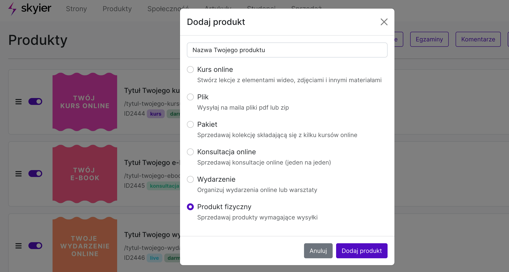
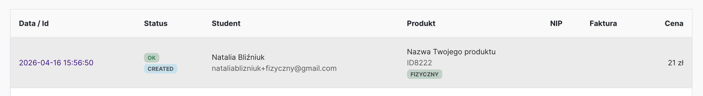
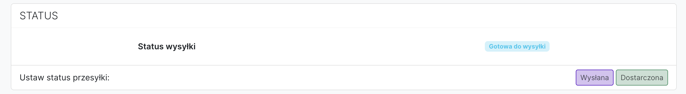
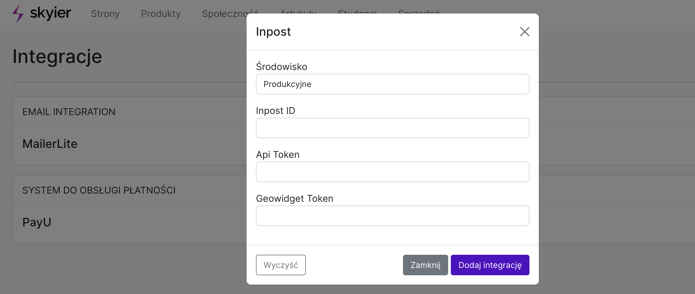
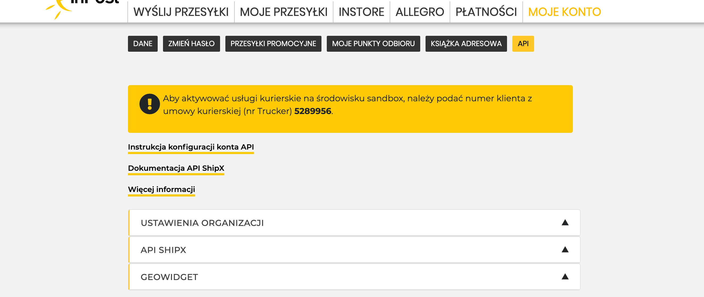
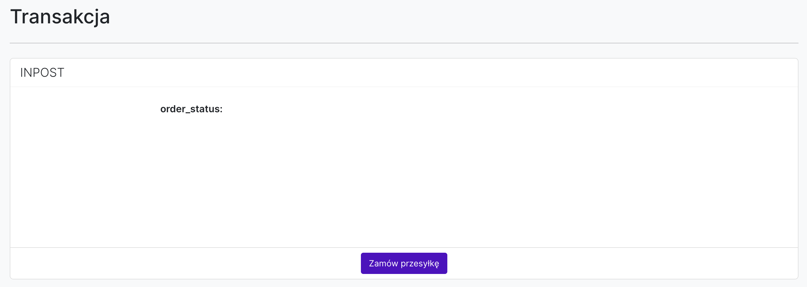

# Produkty fizyczne

## Sprzedaż produktów fizycznych

Aby dodać produkt fizyczny do sprzedaży wybierz w górnym menu zakładkę **PRODUKTY**.

A następnie wpisz **Tytuł**, zaznacz opcję **Produkt fizyczny** i kliknij **Dodaj produkt**.

A następnie:

1. **Dodaj cenę produktu.**

2. **Dodaj cenę za wysyłkę.** - kuriera i paczkomat

3. Stwórz **Stronę sprzedażową**, z informacjami na temat produktu i z przyciskiem do zakupu. 

5. **Opublikuj produkt**. Wejdź na stronę Podukty i kliknij szary przełącznik. Kolor zmieni się na fioletowy.

 

## Skąd mam wiedzieć, gdzie wysłać zamówienie?

1. Wejdź na stronę Sprzedaż. Na liście transakcji znajdziesz listę zakupionych produktów fizycznych. Dodatkowo pojawi się przy nich zielony label PRODUKT FIZYCZNY.

2. Kliknij w datę transakcji -> otworzy Ci się nowa strona ze wszystkimi informacjami na temat tego zakupu. 

3. Możesz ustawić status wysyłki. Wystarczy, że klikniesz w wybrany status: Gotowa do wysyłki, Wysłana, Dostarczona. Abyś wiedział, na jakim etapie jest dana paczka.

 

## Jak zrobić integrację z InPostem?

Istnieje możliwość zrobienia integracji ze swoim InPostem. 

Aby to zrobić wejdź w Integracje, a następnie z listy wybierz opcję InPost.

A następnie ustaw:

1. Środowisko: produkcyjne

2. Inpost ID, czyli ID Organizacji

3. Api Token, czyli Api Shipx

4. Geowidget Token

**Gdzie znaleźć te dane?**

Zaloguj się do swojego konta InPost, a następnie wejdź w Moje konto - API. 

Znajdziesz tam 3 pola: ID Organizacji, Api Shipx i Geowidget, z których należy skopiować dane.

**Jak mogę wykorzystać tą integrację?**

Teraz masz możliwość automatycznego generowania etykiet wysyłkowych. Aby to zrobić:

1. Wejdź na stronę Sprzedaż. Na liście transakcji znajdziesz listę zakupionych produktów fizycznych. Dodatkowo pojawi się przy nich zielony label PRODUKT FIZYCZNY.

2. Kliknij w datę transakcji -> otworzy Ci się nowa strona ze wszystkimi informacjami na temat tego zakupu. 

3. A następnie w sekcji INPOST klikni Zamów przesyłkę.

4. W InPost w Moich przesyłkach znajdziesz utworzoną przesyłkę, do której możesz pobrać etykietę. 
