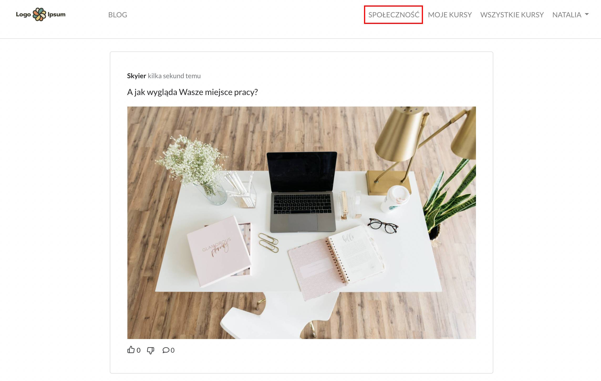

# Ustawienia platformy

## Ustawienia
* **Nazwa strony** - nazwa ta będzie widoczna w lewym górnym rogu (tam, gdzie najczęściej wstawiane jest logo). Jeśli natomiast dodasz logo w poniższej sekcji OBRAZY to wówczas Nazwa strony zostanie zastąpiona logo. 
* **Język strony** - wersja językowa, w jakim będzie dostępna platforma dla studentów. Można wybrać wersję polską lub angielską.
* **Waluta** - waluta, w jakiej będą pobierane opłaty za kursy online. Dostępne waluty: PLN, USD, GBP, EUR, CHF. 
* **Domena** - adres url, pod jakim będzie dostępna platforma do sprzedaży produktów online. Platforma może działać na subdomenie, przykład: kursy.nataliablizniuk.pl. lub na domenie głównej, przykład: nataliablizniuk.pl. 

 

### Jak przekierować domenę?

1. Zaloguj się do swojego panelu zarządzania domeną (ovh, home, the camels, itp.).

2. Znajdź ustawienia rekordów DNS.

3. Dodaj rekord CNAME dla Twojej domeny. W zależności od panelu administracyjnego, powinien on wyglądać mniej więcej tak:

- Domain: your.domain.com	
- Type: CNAME
- Target: secure.skyier.com

4. Upewnij się, że dodałeś poprawną domenę do Ustawień strony w Skyier.

5. Zaczekaj na weryfikację domeny i instalację darmowego certyfikatu SSL. Certyfikaty SSL instalują się raz na dobę, o 04.00 w nocy.

6. Jeśli będziesz miał jakieś problemy, skontaktuj się z nami. Bardzo chętnie pomożemy.

**Linki do instrukcji wideo:**

- przekierowanie domeny głównej: https://www.youtube.com/watch?v=0aYXYqCVILY&t=309s

- przekierowanie subdomeny: https://www.youtube.com/watch?v=cMElydWM6f8

 

## Dane autora
* **Nazwa firmy/Imię i nazwisko**
* **E-mail** - adres e-mail będzie dostępny pod nazwą **Kontakt** w nawigacji dolnej.
* **Copyright** - nazwa ta będzie widoczna w dolnej nawigacji. Jeśli zostawisz to pole puste to pojawi się Nazwa strony, podana w pierwszym polu. W poniższym przykładzie nazwa wpisana w Copyright to Skyier.
* **Copyright url** - link strony, do której ma przekierowywać nazwa podana w Copyright.

 

## Funkcje 

* **Społeczność** - zaznacz, jeśli chcesz aktywować na swojej platformie społeczność. Studenci automatycznie otrzymają dostęp do społeczności i wyświetlanych postów.

* **Dodawania artykułów** - zaznacz, jeśli chcesz na platformie dodawać artykuły. Nazwa, którą podasz będzie widoczna w górnej nawigacji. Może to być na przykład Blog. 

* **Wyświetlaj wiadomość powitalna dla osób, które użyły płatności jednorazowych** - zaznacz, jeśli chcesz wyświetlać wiadomość dla studentów, którzy kupili kurs za pomocą płatności jednorazowych albo po prostu zarejestrowali się do platformy w celu zapoznania się z Twoimi kursami darmowymi (jeśli takie posiadasz). Wiadomość będzie widoczna od razu po zalogowaniu do platformy.

* **Wiadomość powitalna dla subskrybentów** - zaznacz, jeśli chcesz wyświetlać wiadomość dla studentów, którzy dołączyli do Twojej platformy subskrypcyjnej. Wiadomość będzie widoczna od razu po zalogowaniu do platformy. I będzie wyglądała analogicznie do przykładu zamieszczonego powyżej. 

* **Manualne wystawianie faktur** - zaznacz, jeśli chcesz, aby faktura nie została automatycznie wysłana po zakupie kursu. Wówczas, aby wystawić fakturę trzeba wejść w SPRZEDAŻ i przy danej transkacji kliknąć przycisk *attempt*. Wystawienie faktur zadziała tylko w momencie, kiedy jest zrobiona integracja z systemem do fakturowania (InFakt, Fakturownia, iFirma, Taxe, Taxxo).

* **Wystawianie faktur tylko dla firm** - zaznacz, jeśli chcesz, aby faktury nie były automatycznie wystawiane i wysyłane do użytkowników, którzy dokonują zakupu jako "Osoby fizyczne". Dokumenty będą wysyłane wyłącznie do osób, które dokonują zakupu jako "Firma". 

* **Pole do wpisania kodu rabatowego** - zaznacz, jeśli chcesz, aby na stronie płatności pojawiło się pole do wpisania kodu promocyjnego dla użytkowników. Pole to pojawi się nad przyciskiem Kup teraz.

* **Zewnętrzne strony sprzedażowe** - zaznacz, jeśli chcesz stworzyć stronę sprzedażową na WordPressie albo w innym narzędziu. Wówczas platforma będzie wykorzystywana wyłącznie jako panel do nauki i obsługi transkacji. Trzeba pamiętać, aby na swojej stronie sprzedażowej wstawić link przekierowujący na strony zakupowej (checkoutu) Skyier.

* **Dodatkowe linki w nawigacji** - zaznacz, jeśli chcesz dodać linki w górnej nawigacji.

* **Informacja na temat braku możliwości dokonania zwrotu** - informacja pokaże się na stronie dokonywania zakupu (checkoucie), nad przyciskiem KUP TERAZ i będzie miała formę: Klikając poniższy przycisk oświadczam, że chcę natychmiastowego rozpoczęcia świadczenia Usługi i rozumiem, że nie będę mieć możliwości odstąpienia od umowy przed upływem 14 dni.

* **Wymagane checkboxy** - zaznacz, jeśli chcesz na stronie dokonywania zakupu (checkout) wstawić swoją treść zgody. Możesz dodać wiele checkboxów. Wszystkie będą wymagane do zaznaczenia przez użytkownika. W tym polu działa edytor typu [markdown](https://support.skyier.com/docs/consultation.html#jak-dzia%C5%82a-markdown).

* **Opcjonalny checkbox zgody marketingowej** - zaznacz, jeśli chcesz na stronie dokonywania zakupu (checkout) zbierać zapisy na newsletter. Możesz wstawić swoją treść zgody. W tym polu działa edytor typu [markdown](https://support.skyier.com/docs/consultation.html#jak-dzia%C5%82a-markdown). W momencie zaznaczenia przez użytkownika tego checkboxu, wysyłany jest do systemu mailingowego tag: marketing_consent. Więcej o tym tagu przeczytasz [tutaj](https://support.skyier.com/docs/integrations-email.html#tagi). 

* **Opcjonalny numer telefonu** - zaznacz, jeśli chcesz, aby w formularzu do zbierania danych osobowych (na stronie dokonywania zakupu) pojawiło się dodatkowo pole do wpisania numeru telefonu. Pole to nie jest obowiązkowe.

* **Uproszczona strona zakupowa** - zazacz, jeśli nie chcesz zbierać danych do wystawiania faktur lub rachunków. Wówczas na stronie zakupowej (checkout) będzie widoczny wyłącznie formularz rejestracyjny. 

 

## Model pobierania płatności
* **Jednorazowe płatności** - zaznacz, jeśli planujesz sprzedaż kursów online i konsultacji jako jednorazowy zakup.
* **Model subskrypcyjny** - zaznacz, jeśli planujesz uruchomić platformę subskrypcyjną. Systemem płatności, który obsługuje płatności abonamentowe to TPay. 

Jeśli planujesz sprzedaż kursów zarówno w modelu jednorazowym, jak i subskrypcyjnym to zaznacz jednocześnie oba modele pobierania płatności (jednorazowy i subskrypcyjny).

 

## Powiadomienia
* **Chcę otrzymywać powiadomienia o ukończonych transakcjach** - zaznacz, jeśli chcesz otrzymywać maile z informacją o zakupie kursu. Powiadomienie będzie przychodziło na adres e-mail podany przy Rejestracji.
* **Chcę otrzymywać powiadomienia o nowych rejestracjach** - zaznacz, jeśli chcesz otrzymywać maile z informacją o zakładniu konta przez użytkowników. 
* **Chcę otrzymywać powiadomienia o nowych komentarzach** - zaznacz, jeśli chcesz otrzymywać powiadomienia na temat komentarzy pod Twoimi lekcjami. Aby ta funkcja zadziałała przy lekcjach trzeba włączyć możliwość pozostawiania komentarzy przez studentów. Powiadomienie będzie przychodziło na adres e-mail podany przy Rejestracji. 
 

## Informacje prawne
* **Regulamin** - miejsce na regulamin platformy do sprzedaży kursów.
* **Polityka prywatności** - miejsce na politykę prywatności platformy do sprzedaży kursów.

 

## JavaScript
Tutaj wklej kod śledzący. Rekmendowany jest Google Tag Manager. Ale można również dodać inne kody, w zależności od narzędzia, jakiego chcemy użyć (Google Analytics, FB Pixel, Hotjar, itp.). 

 

## Obrazy
* **Favicon** - ikonka, która pojawi się w polu adresowym przeglądarki internetowej czy na karcie w przeglądarce internetowej. W przypadku braku favicony pojawi się favicona Skyier. 
* **Logo** - logo pojawi się w lewym górnym rogu na stronie głównej platformy oraz w panelu do nauki. 

* **Facebook OG Image** - zdjęcie, które się pojawi w momencie udostępniaania strony głównej platformy na Facebook'u.