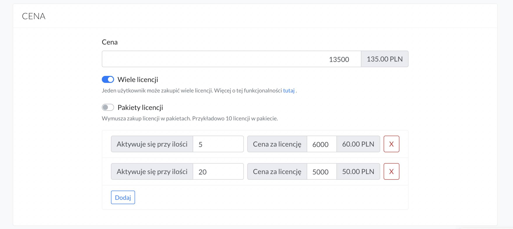

# Sprzedaż

## Cena

1. Aby dodać cenę produktu należy wejść na stronę Produkty. 

2. Wybrać przy produkcie opcję **Edytuj**.


2. A następnie przejść do sekcji **CENA.** 


Cena produktu powinna wynosić minimum 5 zł. 


<br>

## Kody promocyjne

1. Aby stworzyć kod rabatowy wybierz zakładkę **SPRZEDAŻ -> Kody promocyjne**

2. Kliknij przycisk **Dodaj**. Pojawi się krótki formularz do wypełnienia.


Podaj:
* **tytuł** - ta nazwa nie będzie widoczna dla studentów. Podana nazwa powinna pomóc Ci rozpoznać, w jakim celu kod został stworzony.
* **kod** - nazwa, jaką użytkownik będzie musiał wpisać w wyznaczonym polu na stronie zakupowej, aby rabat został naliczony. Kod musi posiadać unikalną nazwę. 
* **data ważności** - definiuje czas trwania kodu. Po upływie ustawionej daty kod traci na ważności. Jeśli nie ustawisz daty ważności, kod będzie ważny przez cały czas. Ustawienie daty końcowej na 21 marca oznacza, że kod będzie aktywny jeszcze w dniu 21 marca do godziny 23.59. 
* **rodzaj** - wybierz czy ma się naliczać rabat procentowy czy kwotowy. 
* **wartość** - w zależności od wybranego rodzaju ustal wielkość rabatu procentowego (np. 30, co oznacza 30%) lub kwotowego (np. 20, co oznacza 20 zł).
* **ilość** - ustal ilość dostępnych kodów rabatowych. Pozostawienie pola pustego oznacza nieograniczoną ilość. 
* **ilość na studenta** - ustal limit użycia danego kodu przez studenta. Pozostawienie pola pustego oznacza nieograniczoną ilość. Przykład: Jeśli w swojej ofercie masz 50 produktów i chcesz, aby uczestnik mógł wybrać 5 produktów i kupić je po niższej cenie (przy użyciu kodu) to wówczas powinieneś ustawić ilość na studenta: 5. 

Wybierz produkty, dla których chcesz zastosować kod:

* **wszystkie kursy** - kod będzie naliczał rabat na wszystkie produkty, jakie posiadasz w ofercie. Czyli na kursy online, pakiety, konsultacje, pliki, wydarzenia online i subskrypcje. 
* **subskrypcja** - kod będzie obejmował wyłącznie rabat na ofertę subskrypcyjną. 
* **produkty z pojedynczą płatnością** - kod będzie naliczał rabat tylko na kursy online, konsultacje, pakiety, pliki i wydarzenia online. Po wybraniu tej opcji kliknij przycisk Przejdź do ustawień. Przejdziesz na stronę, gdzie będziesz mógł wybrać produkty, do których chcesz przypisać ten kod. Możesz ten kod potem **edytować** i zmienić jego podstawowe ustawienia, takie jak: data ważności oraz produkty, na jakie obowiązuje. 


Jeśli chcesz, aby rabat naliczał się po wpisaniu kodu w Pole rabatowe na stronie płatności to należy wejść w **Ustawienia strony -> Funkcje** -> i zaznaczyć opcję *Wyświetlaj pole do wpisania kodu rabatowego na stronie zakupowej.* 

Pole to pojawi się nad przyciskiem KUP TERAZ.


Jeśli natomiast chcesz, aby rabat naliczał się od razu po przejściu na stronę zakupową. To należy do url strony dokonywania zakupu (checkout) dodać na końcu odpowiedni parametr, np: /?promo_code=wiosna20.

I wówczas taki link przyjmie postać https://inspiracje.skyier.pl/tytul-produktu/checkout/?promo_code=wiosna20. I rabat zostanie naliczony automatycznie, bez konieczności wpisywania kodu w Pole rabatowe. 


<br/>

## Program afiliacyjny

Program afiliacyjny to rodzaj współpracy zawartej między Tobą, a reklamodawcą. Osobą, która za pomocą linku afiliacyjnego będzie sprzedawała Twoje produkty online i w zamian otrzymywała ustalone wynagrodzenie. 

**Jak to działa?**

Załóżmy, że Twoja platforma do kursów online znajduje się pod adresem url: https://kursy.nataliablizniuk.pl. W momencie, kiedy chcesz stworzyć link afiliacyjny dla partnera należy na końcu swojego adresu url dodać parametr: **/?af=nazwapartnera.** Parametr (nazwę), który będzie Ci ułatwiał sprawdzanie, ilu studentów i sprzedaży wygenerował dany partner afiliacyjny. Oczywiście to od Ciebie zależy jaką nazwę w tym parametrze podasz. Może ona składać się z liter i cyfr. 

Przykład: Dla partnera chcesz stworzyć link z parametrem na końcu: przykladowy_kod. Finalnie link partnerski będzie miał wówczas postać: 
https://kursy.nataliablizniuk.pl/?af=przykladowy_kod. I właśnie taki link przekazujesz dla swojego reklamodawcy. 

Oczywiście, jeśli masz kilku partnerów afiliacyjnych to jak najbardziej możesz stworzyć kilka linków, dedykowanych dla każdego z nich.

**Co dalej?**

W platformie w zakładce STUDENCI możesz sprawdzić, ile osób założyło konto z danego linku partnerskiego.


A w zakładce SPRZEDAŻ, ile osób zakupiło kurs z danego linku partnerskiego. 


Prowadzenie rozliczeń pomiędzy Tobą, a patnerami afiliacyjnymi należy robić już we własnym zakresie. Platforma wyłącznie zlicza rejestrację studentów i zakup. Ale nie posiada panelu do prowadzenia rozliczeń z partnerami.

<br/>

## Cena promocyjna

1. Aby ustawić cenę promocyjną produktu należy wejść na stronę Produkty. 

2. Wybrać przy produkcie opcję **Edytuj**.


Następnie przejść do sekcji **CENA** i zaznaczyć opcję *Produkt jest w promocji.* 


**Przy ustalaniu ceny promocyjnej należy podać:**
* Cenę standardową
* Cenę promocyjną
* Najniższą cenę z 30 dni. Według wprowadzonej dyrektywy Omnibus jesteś zobowiązany do podania najniższej ceny produktu sprzed 30 dni.
* okres trwania promocji (od-do). Ustawienie daty końcowej na 21 marca oznacza, że cena promocyjna będzie aktywna jeszcze w dniu 21 marca do godziny 23.59. 

Po zakończeniu promocji cena zmieni się automatycznie na cenę standardową. 
 
* Ilość produktów w cenie promocyjnej. Jeśli chcesz możesz podać, ile produktów dostępnych jest w cenie promocyjnej. Zmiana ceny z promocyjnej na standardową nastąpi w momencie wyprzedaży wszystkich produktów w niższej cenie lub w momencie zakończenia promocji (według ustawionej daty). W zależności od tego, która sytuacja nastąpi pierwsza. 

**-1 oznacza nieskoczoną ilość kursów dostępnych w cenie promocyjnej.**

**W momencie ustawienia Ceny promocyjnej, Kod rabatowy będzie naliczany od ceny standardowej, a nie promocyjnej.**
Przykład: Jeśli ustawimy: <br>
Cena standardowa kursu - 35 zł<br>
Cena promocyjna - 12 zł<br>
Cena po uwzględnieniu kodu rabatowego (zakładając, że ustawimy kod rabatowy na 50%) - 17,5 zł

<br/>

## Stawka VAT

Ta opcja jest dla osób, które:

* Mają podpiętą integrację z jakimś systemem do fakturowania (InFakt, Fakturownia, itp.)
* Sprzedają produkty online, które mają inną stawkę VAT niż standardowa stawka VAT ustawiona w integracji.

Przykład: Jeśli Twoją standardową stawką VAT jest 23%, ale sprzedajesz ebook, dla którego stawka VAT wynosi 5% to wówczas ustaw ją przy tym konkretnym produkcie. W innym przypadku zostanie naliczana Twoja standardowa stawka, czyli np. 23%. 

<br/>

## Ustalenie ceny za pomocą linku

Dzięki ustaleniu ceny za pomocą linku możesz: 

* **zaproponować zakup tego samego kursu w kilku różnych cenach.** Oferując inną ceną dla klientów indywidualnych, a inną dla korporacyjnych. 
* **poprosić użytkowników o zaproponowanie ceny, jaką chcą zapłacić.** Udostępniając im suwak, który umożliwi im w prosty sposób ustalenie swojej ceny. 


Aby ustawić cenę za pomocą linku należy wejść w **Edycję kursu.**


Przejść do sekcji **CENA** i zaznaczyć opcję *Ustalanie ceny za pomocą linku.* 


Przy takim ustawieniu **nie ma możliwości oferowania produktu za 0 zł.** Wartość, jaką wpiszemy w polu Cena (na przykładzie wynosi ona 109) definiuje, jaką najniższą cenę może zapłacić użytkownik. Dzięki temu można się zabezpieczyć przed bardzo niskim wpłatami. 

W przypadku, kiedy natomiast chcemy pozwolić użytkownikowi nabyć produkt **za darmo**. **Wówczas należy dodatkowo włączyć opcję Darmowy.** Przy takich ustawianiach użytkownik może zapłacić 0 zł lub inną dowoloną, wybraną przez siebie cenę. 


<br>

### Zakup kursu w kilku różnych cenach

Aby umożliwić zakup tego samego kursu np. w 2 różnych cenach, należy:

* **Zdecydować, w jakich cenach chcemy sprzedawać kurs.** Załóżmy, że będą to ceny: 99 zł i 149 zł.

* **Stworzyć linki do strony zakupowej (checkoutu).** W tym wypadku należy pamiętać o dodaniu na końcu url parametru **?price=9900** i **?price=14900**. Czyli parametrów, w których będzie zaszyta cena.

Taki link posiada strukturę: htpps://domena/tytul-kursu/checkout?price=9900

Przykład: 

https://inspiracje.skyier.pl/numer-dwa-strona-do-sprzedazy-kursu-online/checkout?price=9900

https://inspiracje.skyier.pl/numer-dwa-strona-do-sprzedazy-kursu-online/checkout?price=14900

Mając przygotowane 2 takie linki, wystarczy je teraz umieścić w postaci przycisków na swojej stronie sprzedażowej. 

W edytorze tekstu masz do dyspozycji opcję, która umożliwia dodawanie przycisków. Wybierz ikonkę "kwadratu".


<br>

### Zapłać, ile chcesz. Ustalanie ceny poprzez link

Aby umożliwić użytkownikowi zdecydowanie za pomocą suwaka, ile chce zapłacić za kurs, należy:


* **Wejść na Ustawienie strony i w sekcji Head JavaScript wkleić w całości poniższy kod:**
```html

<script>
  document.addEventListener("DOMContentLoaded", function (event) {
    const range_inputs = document.querySelectorAll(".price-range");
    const price_placeholders = document.querySelectorAll(".price-placeholder");
    const price_links = document.querySelectorAll(".price-link");
    const imagePlaceholders = document.querySelectorAll(".image-placeholder");
    const currency = "PLN";

    if (range_inputs && price_placeholders && price_links && price_links[0]) {
      let base_url = "";

      try {
        base_url = new URL(price_links[0].getAttribute("href"));
      } catch (e) {
        base_url = new URL(
          window.location.origin + window.location.pathname + "/checkout"
        );
      }

      let price_initial = base_url.searchParams.get("price");

      if (!price_initial) {
        price_initial = (range_inputs[0].getAttribute("max") * 100) / 2;
      }

      const p = Math.round(price_initial / 100);
      base_url.searchParams.set("price", p * 100);

      range_inputs.forEach(function (r) {
        r.value = p;
      });

      price_placeholders.forEach(function (pp) {
        pp.textContent = p + " " + currency;
      });

      price_links.forEach(function (pl) {
        pl.setAttribute("href", base_url.toString());
      });

      range_inputs.forEach(function (r) {
        r.addEventListener("input", function (event) {
          price_placeholders.forEach(function (pp) {
            pp.textContent = event.target.value + " " + currency;
          });
          base_url.searchParams.set("price", event.target.value * 100);
          price_links.forEach(function (pl) {
            pl.setAttribute("href", base_url.toString());
          });
          range_inputs.forEach(function (range_input) {
            range_input.value = event.target.value;
          });
          if (event.target.value === "0") {
            imagePlaceholders.forEach(function (placehoder) {
              placehoder.classList.remove("d-none");
            });
          } else {
            imagePlaceholders.forEach(function (placehoder) {
              placehoder.classList.add("d-none");
            });
          }
        });
      });
    }
  });
</script>

```

* **Wejść na stronę sprzedażową danego kursu**
* **Wybrać komponent HTML i wkleić do niego poniższy kod**

```html
<div class="row">
    <div class="col">
        <div class="text-center">
          <label for="price" class="form-label"><h3>Zaproponuj swoją cenę:</h3></label>
            <input type="range" class="form-range price-range" min="99" max="500" step="10" id="price-range">
        </div>
        <div class="d-flex">
            <span>99 PLN</span>
            <span class="ms-auto">500 PLN</span>
        </div>
        <div class="text-center mt-5">
            <a href="/tytul-kursu/checkout?price=30000" id="price-link" class="btn btn-danger btn-lg price-link">Chcę zapłacić <span class="price-placeholder" id="price-placeholder"></span></a>
        </div>
        <div class="image-placeholder d-none text-center">
          
        </div>
    </div>
</div>

```

W przypadku tego kodu możemy zdefiniować:

* **jaka wartość minimalna pojawi się na suwaku.** Na przykładzie wynosi ona 99 zł. Ale możesz tam wstawić inną wartość. 
Pamiętaj, aby wartość 99 zł zmienić w dwóch wskazanych miejscach. 


* **jaka wartość maksymalna pojawi się na suwaku.** Na przykładzie wynosi ona 500 zł. Ale możesz tam wstawić inną wartość. 
Pamiętaj, aby wartość 500 zł zmienić w dwóch wskazanych miejscach.


* **co ile będzie przeskakiwała cena na suwaku.** Na przykładzie podane jest 10. Oznacza to, że co 10 zł będzie zmieniała się cena na suwaku. Możesz tam również wstawić 1, 5, a nawet 20. W zależności od tego, co ile cena powinna się zmieniać.

* **link do checkoutu. Wstaw swój link do strony zakupowej.** W tym wypadku na końcu url w parametrze możesz zaproponować swoją cenę. W przykładzie wynosi ona 300 zł. Ale równie dobrze możesz wstawić tam minimalną, np. 99 zł.


* **link do obrazka.** Kiedy dasz możliwość ustawienia ceny 0 zł, czyli nabycia produktu za darmo. To w momencie, gdy ktoś rzeczywiście ustawi na suwaku cenę 0, może pokazać się na stronie gif lub zdjęcie. Na przykład wskazujące na to, że może jednak warto zapłacić coś więcej. 


Na stronie to wygląda tak:


<br>

## Sprzedaż wielu licencji

Aby ustawić cenę dla wielu licencji należy wejść w **Edycję kursu.**


Przejść do sekcji **CENA** i zaznaczyć opcję *Wiele licencji.* 


A następnie dodać różne warianty cenowe, poprzez wybranie opcji *Dodaj.*




Kiedy użytkownik będzie chciał kupić 1-4 licencje, to za każdą zapłaci po 135 zł, ponieważ cena 60 zł za licencję aktywuje się dopiero przy zakupie 5 licencji. A cena 50 zł za licencję aktywuje się dopiero przy zakupie 20 licencji i więcej. 


Natomiast, kiedy dodatkowo zostanie włączona opcję *Pakiety licencji* można narzucić ile licencji może kupić użytkownik. W poniższym przykładzie jest to: 1, 5 lub 20. 


I wówczas na stronie płatności wybór ilości licencji wygląda tak:


Po zakupie użytkownik przechodzi do panelu Zarządzania dostępami, gdzie podaje adresy e-mail osób, które powinny mieć dostęp do kursu. 


Osoby przynająca dostępy ma do dyspozycji tylko tyle dostępów, ile zostało wykupionych. 

Dostęp do kursu jest przyznawany w momencie, kiedy użytkownik przyjmnie zaproszenie. 

Jeśli zaproszenie nie zostanie przyjęte, osoba zarządzająca dostępami może takie zaproszenie usunąć i wysyłać dla innej osoby.

Jeśli osoba zarządzająca dostępami chce mieć dostęp do kursu to musi zaproszenie wysłać również sobie.


W przypadku sprzedaży kursów w modelu wielu licencji nie działa funkcja **Kodów rabatowych.**

<br>

## Warianty cenowe

Aby stworzyć różne warianty cenowe należy wejść w **Edycję kursu.**

Przejść do sekcji **CENA** i zaznaczyć opcję *Warianty cenowe.* 

A następnie dodać różne warianty cenowe, klikając w przycisk *Dodaj.* Maksymalnie możemy utworzyć 3 warianty cenowe. Dodając przy nich tytuł i cenę.


Adres url, który pokazuje się pod każdym wariantem to link do strony dokonywania zakupu. Używamy go, jeśli chcemy podpiąć linki pod przyciski zakupowe na stronie sprzedażowej. 

Kolejnym krokiem jest ustalenie zawartości kursu dla poszczególnych wariantów cenowych. Aby to zrobić należy:

1. Przejść do Listy lekcji kursu

2. Wybrać przy sekcji *Warianty cenowe.* 


3. A następnie zdecydować, która sekcja jest dostępna dla jakiego wariantu. Domyślnie wszystkie sekcje są dostępne dla wszystkich wariantów cenowych. Dlatego, jeśli chcemy, aby jakaś sekcja była dostępna tylko dla wariantu 0 i 1 należy odznaczyć wariant 2. 


**Dodatkowe informacje**

Jeśli usuniemy ustawione warianty cenowe lub wyłączymy opcję *Warianty cenowe* to studenci, którzy zakupili wcześniej kurs będą mieli dostęp do takiej zawartości kursu, jaką wykupili. Przykład, jeśli student wykupił opcję Standard będzie miał zawsze dostęp do wersji Standard.

Jeśli kurs będzie sprzedawany w pakiecie to studenci będą mieli dostęp do wszystkich lekcji. Tutaj podział na warinaty cenowe nie obowiązuje.

Jeśli wyłączymy opcję *Warianty cenowe* i zaczniemy sprzedawać kurs tylko w jednej cenie, student przy zakupie będzie miał dostęp do wszystkich lekcji. Wówczas podział na warianty cenowe przestaje obowiązywać. 

<br>

## Cross-selling. Dosprzedaż

Jeśli chcesz na stronie zakupowej umożliwić użytkownikowi zakup dodatkowego produktu to skorzystaj z opcji Dosprzedaży - Cross-selling'u. Użytkownik na etapie dokonywania zakupu będzie mógł zdecydować, czy i który produkt chce jeszcze dokupić. 

**Jak to działa?**

Aby włączyć Dosprzedaż należy wejść w **Edycję kursu.**


A następnie przejść do sekcji **Dosprzedaż -> wybrać Ustawienia**


I kliknąć przycisk **Dodaj**. Pojawi się formularz, który należy uzupełnić.


- **wybierz kurs** - należy wybrać kurs online, który chcemy jeszcze zaproponować w dosprzedaży
- **cena** - należy podać cenę za zakup tego kursu online
- **pokaż oryginalną cenę z przekreśleniem** - jeśli oferujemy zakup tego kursu online w niższej cenie (czyli w innej cenie niż jest on sprzedawany standardowo) można włączyć tą opcję. Dzięki temu użytkownik będzie widział, że obowiązuje dla niego cena niższa. 
- **treść zgody** - użytkownik musi zaznaczyć na stronie zakupowej checbox, wyrażając zgodę na dodanie produktu do koszyka. W tym miejscu można zaproponować swój tekst, zachęcając go do skorzystania z oferty. Max. długośc tekstu wynosi 255 znaków. Jeśli pole pozostanie puste, pojawi się tekst: Dodaj do zamówienia.
- **nagłówek** - jest to miejsce, które można wykorzystać do krótkiego opisu produktu wraz z tytułem. Maksymalna długość tekstu wynosi 225 znaków. Jeśli pole pozostanie puste, pojawi się tytuł wybranego kursu online.

Zapisujemy zmiany. Na liście pojawił się stworzony produkt.

Ostatnim krokiem jest po prostu wybranie tego produktu. **Klikając i zaznaczając go na niebiesko.**


Tak wygląda strona zakupowa po dodaniu do sprzedaży jeszcze jednego kursu online


**Ważne**

1. Cross-selling działa wyłącznie na produktach, typu Kurs online. Nie można w dosprzedaży proponować zakupu Konsultacji, Pakietów czy Wydarzeń online.

2. Można zaproponować dokupienie nie tylko jednego kursu online, ale również dwóch, trzech lub więcej.

3. Dosprzedaż obowiązuje tylko przy kursach online, które są sprzedawane w modelu Cena standardowa lub W promocji. Czyli, jeśli mamy kurs online o nazwie Moduł 1 i chcemy do niego zaproponować możliwość dokupienia jeszcze jednego produktu. To ten kurs Moduł 1 musi być sprzedwany właśnie w modelu: Cena standardowa lub W promocji. Nie może być sprzedwawany w modelu: Cena ustalana linkiem, Warinaty cenowe, Wiele licencji, Darmowy.

<br>

## Odzyskiwanie sprzedaży

Funkcja ta daje możliwość wysłania wiadomości po niedokończonym zakupie w celu odzyskania koszyka. Aby skorzystać z tej funkcji należy wejść w **SPRZEDAŻ -> Odzyskiwanie sprzedaży**.

**Jak to działa?**

Użytkownik wchodzi na stronę zakupową w celu dokonania zakupu. Po wypełnieniu formularza ze swoimi danymi, a następnie kliknięciu przycisku Kupuję i płacę wychodzi ze strony. Proces zakupowy został rozpoczęty, ale nie dokończony. **Mówimy tutaj o tzw. porzuconym koszyku.** Jeśli chcemy użytkownika zachęcić do powrotu i dokończenia zakupu możemy wysłać jemu automatyczną wiadomość. 

**Aby włączyć odzyskiwanie sprzedaży** należy kliknąć toggle (przełącznik), który jest przy przycisku Zapisz.


A następnie w **Ustawieniach wybrać czas, po jakim ma zostać wysłana wiadomość do użytkownika, który nie dokończył zakupu**. Tutaj mamy do wyboru, po: 

- 1 godzinie
- 3 godzinach
- 6 godzinach
- 10 godzinach
- 24 godzinach 

Domyślnie jest ustawiony czas: po 3 godzinach. 

W sekcji **Wiadomość po nieudanym zakupie** wpisujemy treść wiadomości, jaką chcemy wysłać. Czyli:

- **tytuł** - tytuł wiadomości, jaką użytkownik zobaczy w swojej skrzynce mailowej
- **treść** - wiadomość zachęcająca do powrotu i dokończenia zakupu
- **wezwanie do działania** - czyli CTA, jakie pojawi się na przycisku. Po kliknięciu w przycisk użytkownik automatycznie zostanie przekierowany do strony zakupowej w celu dokończenia rozpoczętego procesu zakupowego.

**Wiadomość ta wygląda tak:**


**Istnieje możliwość wysłania wiadomości w formie zwykłego tekstu (bez nagłówku, kolorowego przycisku, itp).**

**Wiadomość ta wygląda tak:**


**WAŻNE**

- jeśli został ustawiony czas wysyłki wiadomości np.: po 1 godzinie, ale do tego czasu użytkownik dokończył (wcześniej rozpoczęty) proces zakupowy **wiadomość nie zostanie do niego wysłana**.
- jeśli użytkownik rozpoczął zakup produktu, ale nie dokończył to np: po 1 godzinie zostanie wysłana do niego wiadomość. Jeśli po otrzymanej wiadomości ponownie rozpocznie proces zakupowy, ale ponownie nie dokończy. Kolejna wiadomość po upływie 1 godziny nie zostanie wysłana. **Podsumowując: wiadomosć wysyłana jest tylko raz.** 
- jeśli użytkownik rozpoczął zakup produktu A (ale nie dokończył), a następnie rozpoczął zakup produktu B (i również nie dokończył) to w otrzymanej wiadomości zostanie przekierowany do **dokończenia zakupu produktu B.**
- funkcja ta działa **wyłącznie przy płatnościach jednorazowych**, a nie subskrypcyjnych (czyli, jeśli ktoś rozpoczął proces podpinania karty pod platformę subskrypcyjną, ale nie dokończył. Wiadomość nie zostanie wysłana).

<br/>


## Adres url po zakupie produktu

Adres url po zakupie produktu online ma strukturę: https://adres-domeny/id-produktu/unikalny-numer-zamowienia/payment/success

Przykład: https://inspiracje.skyier.pl/2265/s7snE45UIwPw/payment/success

Niezmieniającymi się danymi w adresie jest: /payment/success

<br/>

## Zakup produktu wyłącznie przez wybrane osoby

Jeśli chcesz umożliwić zakup produktu online tylko dla wybranych osób (np. osobom, które zapisały się na newsletter) skorzystaj z opcji **Ukryj na liście produktów**.

Aby ją włączyć należy wejść w **Edycję produktu.** 


A następnie przejść do **sekcji SZCZEGÓŁY** i zaznaczyć opcję *Ukryj na liście produktów*. 


Ostatnim krokiem jest wysłanie wybranym osobom **linku do strony sprzedażowej lub bezpośrednio do strony zakupowej**.

Znajdziesz ten link na stronie PRODUKTY, po kliknięciu w ikonkę **linku** przy wybranym produkcie.


**WAŻNE.** Włączenie tej opcji spodowuje, że produkt online nie będzie widoczny dla pozostałych użytkowników. Nie pokaże się on na:

- liście wszystkich produktów online na stronie głównej (jeśli użyłeś tego komponentu) 


- liście wszystkich produktów online w panelu uczestnika (po zalogowaniu)


<br>

## Wyłączenie produktu ze sprzedaży

Aby wyłączyć produkt ze sprzedaży należy wejść w **Edycję produktu.** 


A następnie przejść do **sekcji SZCZEGÓŁY** i zaznaczyć opcję *Produkt wyłączony ze sprzedaży*. 


Na stronie sprzedażowej (checkoucie) napis na przycisku zakupowym zmieni się z *Kupuję i płacę* na *Produkt wyłączony ze sprzedaży* i zakup nie będzie możliwy. 


**Dzięki tej opcji możliwe jest wyłączenie produktu z dalszej sprzedaży. Osoby, które zakupiły produkt przed włączeniem tej opcji nadal będą miały do niego dostęp.** 

<br>

## Ograniczona ilość miejsc

Aby włączyć limit sprzedaży produktu należy wejść w **Edycję produktu.** 


A następnie przejść do **sekcji SZCZEGÓŁY** i włączyć opcję *Ograniczona ilość miejsc*. Należy podać ilość produktów oferowanych w sprzedaży oraz, od kiedy ma być naliczany limit. 


Po wyprzedaniu wszystkich ilości na stronie sprzedażowej (checkoucie) napis na przycisku zakupowym zmieni się z *Kupuję i płacę* na *Produkt wyłączony ze sprzedaży* i dalszy zakup produktu nie będzie możliwy. 


<br>

## Limit dostępu do produktu

Aby włączyć limit sprzedaży produktu należy wejść w **Edycję produktu.** 


A następnie przejść do **sekcji SZCZEGÓŁY** i ustawić limit dostępu do produktu.  

Można ustawić limit:

* **czasowy** - pozwala przydzielić dostęp do produktu np. na 90 dni. Odliczanie zaczyna się od dnia dokonania zakupu przez użytkownika. Po tych dniach dostęp zostanie odebrany automatycznie.
* **w oparciu o datę** - należy wybrać datę, do kiedy uczestnicy powinni mieć dostęp do produktu. Po tej dacie dostęp zostanie odebrany automatycznie. 

