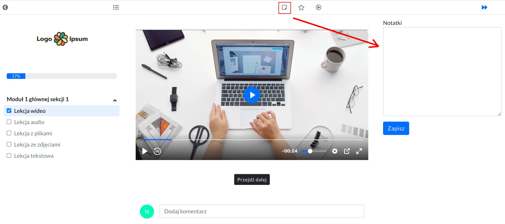

# Panel Studenta

## Logowanie do platformy 

Aby zalogować się do platformy należy kliknąć w opcję LOGOWANIE (górny prawy róg strony), a następnie uzupełnić formularz logowania.

**W formularzu podaj adres e-mail i hasło. Dane, które podałeś na etapie dokonywania zakupu.**

**W sytuacji, kiedy otrzymałeś wiadomość e-mail z zaproszeniem dołączenia do platformy, podaj e-mail i hasło, które było w treści tej wiadomości.** 

 

## Zmiana hasła

**Zmiany hasła logowania do platformy można dokonać na dwa sposoby:**

- **skorzystanie z opcji Zapomniałeś hasła?**, która jest dostępna na stronie z formularzem logowania. Ten sposób warto zastosować w przypadku, kiedy nie pamiętasz hasła i system pokazuje informację, że **Podane dane są błędne.** 

- **po zalogowaniu, przechodząc do Ustawień.** Ten sposób warto zastosować w przypadku, kiedy hasło dostępu otrzymałeś w e-mailu z zaproszeniem i chcesz je zmienić.

 

## Dostęp do kursów

Po zalogowaniu automatycznie zostaniesz przeniesiony na stronę **MOJE KURSY**. Tutaj znajdziesz produkty przez Ciebie zakupione lub do których otrzymałeś dostęp.

W zakładce **WSZYSTKIE KURSY** są pokazane wszystkie produkty, jakie aktualnie są w sprzedaży.

 

## Funkcje platformy

**W platformie możesz korzystać z następujących funkcji:**

- **oznaczanie lekcji jako ulubiona.** Dzięki czemu łatwiej będzie później wrócić do materiału, który Ci się spodobał.

- **robienie notatek.** W czasie ogladania możesz na bieżąco robić notatki z ważniejszych informacji.

- **pasek postępu.** Informujący, jaki procent kursu online został już ukończony.

- **ukrywanie listy lekcji.** Włącz, jeśli chcesz oglądać wideo na większym ekranie.

- **nawigacja**, umożliwiająca płynne przechodzenie do kolejnych lekcji.

- **komentarze.** Możliwość komentowania, ale tylko wtedy, kiedy ta opcja została włączona przez autora kursu.

 

## Funkcje playera

W przypadku playera można:

- **automatycznie cofać filmik o 10 sekund**

- **ustawić głośność**

- **wybrać jakość odtwarzanego filmiku i ewentualne przyspieszenie**

- **otworzyć tzw. okno w oknie.** Dzięki czemu można okno z wideo przenieść sobie na inną stronę. Opcję tą włączamy w momencie, kiedy wideo jest już odtwarzane. 

I wówczas wygląda to tak:

- **odtwarzyć wideo na całym ekranie**

