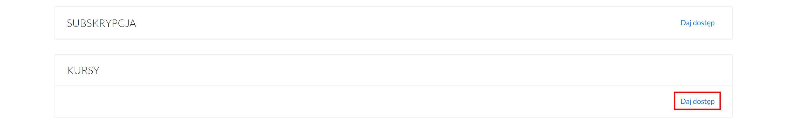

# Zarządzanie studentami

## Dodawanie studenta

1. Aby dodać studenta do platformy należy wybrać z górnego menu zakłądkę **STUDENCI**.
2. A następnie kliknąć **Dodaj studenta**. W przypadku, kiedy chcemy dodać większą ilość osób wybieramy **Importuj studentów**. 

Wpisujemy imię i adres e-mail studenta.

Na podany e-mail uczestnik otrzyma wiadomość z danymi do logowania (e-mail, hasło). Hasło może zostać przez studenta zmienione po zalogowaniu do platformy. 

 

## Nadawanie dostępu

**Jeśli chcemy dać dostęp studentowi do kursu to możemy to zrobić na dwa sposoby.**

**Zalecany w przypadku, kiedy chcemy nadać dostęp dla konkretnego studenta.** 

Klikamy w e-mail studenta i przechodzimy na stronę, gdzie wybieramy kurs, do którego chcemy nadać dostęp

**Zalecany w przypadku, kiedy chcemy nadać dostęp dla wielu studentów.**

Przechodzimy do zakładki **SPRZEDAŻ** -> klikamy **Zarządzaj dostępami**, następnie podajemy e-maile oraz wybieramy kurs, do którego uczestnicy powinni mieć dostęp. 

 

## Usuwanie studenta

Aby usunąć studenta z platformy wejdź w zakładkę **STUDENCI**.

Za pomocą wyszukiwarki, wyszukaj studenta (po e-mail, imieniu), którego chcesz usunąć.

A następnie **kliknij w jego e-mail.** Zostaniesz przenieosiony na stronę ze wszystkimi informajcami na temat tej konkretnej osoby.

W górnym prawym rogu znajdziesz przycisk **Usuń studenta**. 

Kliknij w niego, a uczestnik zostanie usunięty w platformy, a wraz ze wszystkimi danymi.

 

## Ustawianie hasła

Aby ustawić hasło dla studenta wejdź w zakładkę **STUDENCI**.

Za pomocą wyszukiwarki, wyszukaj studenta (po e-mail, imieniu), któremu chcesz nadać hasło.

A następnie **kliknij w jego e-mail.** Zostaniesz przenieosiony na stronę ze wszystkimi informajcami na temat tej konkretnej osoby.

W górnym prawym rogu znajdziesz przycisk **Ustaw hasło**. 

Kliknij w niego i podaj nowe hasło dla studenta. Będzie to hasło, za pomocą którego student będzie logował się do platformy w celu oglądania kursów online lub innych materiałów.

