# Subskrypcja

Sprzedaż produktów online w modelu subskrypcyjnym możliwa jest z jednym z następujących systemów płatności: **PayU, TPay lub Stripe.** 

## Sprzedaż subskrypcyjna
Aby włączyć metodę sprzedaży w modelu subskrypcyjnym należy przejść do **Ustawień strony -> Model pobierania płatności -> zaznaczyć opcję *Model subskrypcyjny*.**

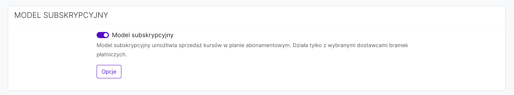

 

## Plany subskrypcyjne

Aby dodać plan subskrypcyjny należy przejść do **Ustawienia konta -> Model pobierania płatności -> *Model subskrypcyjny*: *Opcje*.**

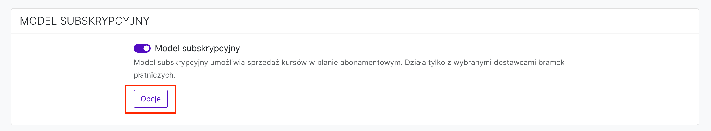

A następnie kliknąć przycisk **Dodaj**. 

Należy uzupełnić następujące dane:

* **Nagłówek** - jest to tytuł planu, który będzie widoczny dla użytkownika na stronie:

**a) z ofertą planów subskrypcyjnych**

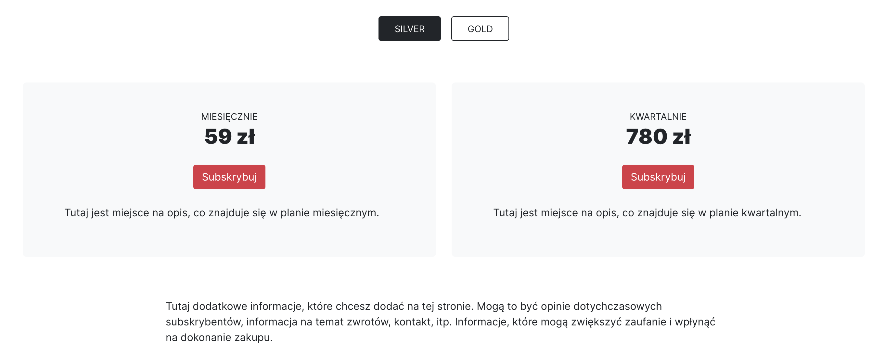

**b) na stronie dokonywania zakupu (checkoucie)**

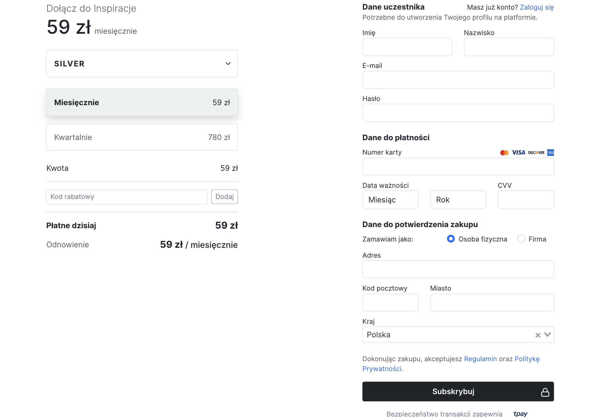

* **Produkty** - należy zaznaczyć produkty, do jakich chcemy, aby użytkownicy mieli dostęp w ramach subskrypcji. Mogą mieć dostęp do wszystkich produktów, jakie są na platformie. Lub tylko do kilku wybranych. 

Jeśli zostanie wybrana opcja:

- **Wszystko** - to wówczas uczestnicy będą mieli dostęp do wszystkich produktów dostępnych na platformie. Z wyjątkiem produktów, które mają włączoną opcję **Sprzedaż poza subskrypcją**. Co to znaczy? Załóżmy, że na platformie masz 10 kursów wideo, które chcesz udostępniać w ramach subskrypcji. Ale masz też e-book, który (z jakiegoś powodu) nie chcesz, aby wchodził w pakiet subskrypcyjny. Włączenie przy nim opcji [Sprzedaż poza subskrypcją] (https://support.skyier.com/docs/subscription.html#sprzedaz-kursu-poza-subskrypcja) spowoduje, że subskrybenci nie będą mieli do niego dostępu. 

- **Wybrano** - można też wybrać, do jakich konkretnie produktów uczestnicy powinni mieć dostęp w ramach subskrypcji. Bo mogą mieć dostęp na przykład tylko do kilku wybranych. Ale UWAGA w tym wypadku, jeśli zostanie wybrany produkt, przy którym jest włączona opcja **Sprzedaż poza subskrypcją**, to również wejdzie on w pakiet tego planu. Inaczej mówiąc subskrybenci w tym wypadku będą mieli do niego dostęp. 

* **Studenci mogą przejść na ten plan** - ta funkcja zadziała w sytuacji, kiedy jest stworzonych kilka planów subskrypcyjnych. Na przykład plan Silver i plan Gold. Włączając tą opcję dajesz możliwość subskrybentom zmianę planu w dowolnym momencie. 

* **Ukryj ten plan** - oznacza, że dany plan może być dostępny tylko dla wybranej grupy osób. Włączenie tej opcji spowoduje, że nie będzie on wiodczny na Twojej stronie z ofertą ani na stronie zakupowej. 

Do dyspozycji jest:

* **Trial** - o tym, jak działa trial znajdziesz informacje poniżej.
* **Miesięczny** - użytkownik wykupuje dostęp do platformy na miesiąc. I raz w miesiącu pobierana jest opłata z jego karty kredytowej.
* **Kwartalny** - użytkownik wykupuje dostęp do platformy na 3 miesiące. I raz na 3 miesiące pobierana jest opłata z jego karty kredytowej.
* **Półroczny** - użytkownik wykupuje dostęp na 6 miesięcy. I raz na 6 miesięcy pobierana jest opłata z jego karty kredytowej.
* **Roczny** - użytkownik wykupuje dostęp na 12 miesięcy. I raz na 12 miesięcy pobierana jest opłata z jego karty kredytowej.
* **Lifetime** - użytkownik wykupuje stały dostęp do platformy. Płaci raz i ma nieograniczony dostęp czasowy. 

Pod każdym planem można dodać opis. Opis, który będzie informował użytkownika co wchodzi w skład każdego planu. Opis ten będzie widoczny na Twojej stronie z ofertą, dostępną pod adresem: https://nazwa-twojej-domeny/subscribe. Oraz na stronie głównej, w momencie, kiedy dodasz komponent **Plany subskrypcyjne.** 

### Trial

Opcję trail włączamy, jeśli chcemy dać użytkownikowi możliwość przetestowania platformy za niższą cenę. W tym wypadku możemy ustawić ofertę, na przykład 7 dni za 7 zł. Oznacza to, że użytkownicy będą mieli dostęp do platformy na 7 dni i zostaną obciążoni kwotą 7 zł. 

Oczywiście można ustawić dowoloną ilość dni dostępu i dowoloną cenę. 

Co się dzieje po okresie trial?

Po okresie trial (czyli w tym wypadku po 7 dniach) użytkownicy będą obciążani kwotą planu, który wybrali przy dokonywaniu płatności. Na stronie zakupowej są informowani o tym, że kupują dostęp do platformy na 7 dni za 7 zł, a następnie zostaną obciążeni inną kwotą, w zależności od planu, który wybiorą. Jeśli w ciągu tych 7 dni anulują subskrypcję to nie zostaną obciążeni żadnymi dodatkowymi płatnościami. 

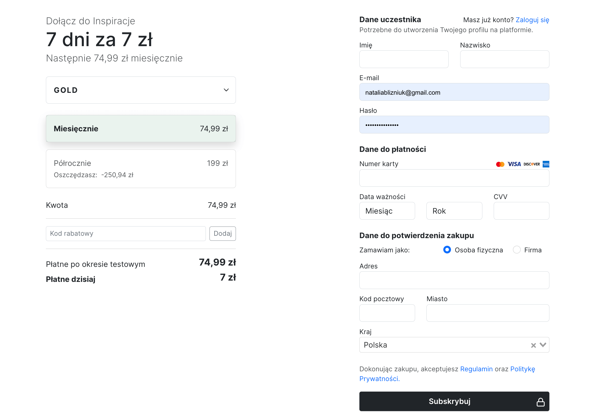

 

## Dodatkowe informacje

### Strona zakupowa (checkout) 

Istnieje możliwość wstawienia dodatkowych informacji na stronie zakupowej. Informacje te będą widoczne pod planami subskrypcyjnymi. 

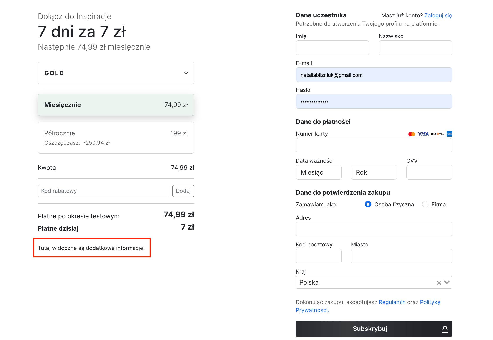

Aby dodać te informacje należy włączyć opcję: Informacje dodatkowe na stronie /subscribe/checkout.

### Strona z wyborem planu

Istnieje też możliwość wstawienia dodatkowych informacji na stronie z wyborem i opisem poszczególnych planów subskrypcyjnych.

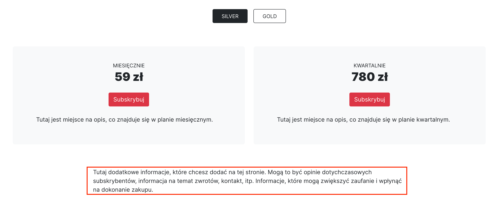

Aby dodać te informacje należy przejść do sekcji: Informacje dodatkowe na stronie /subscribe.

 

## Strona z ofertą subskrypcyjną

Strona z ofertą planów subskrypcyjnych jest tworzona automatycznie i znajduje się pod adresem: https://nazwa-twojej-domeny/subscribe

 

## Pokazanie planów subskrypcyjnych na stronie głównej

Aby wyświetlić oferowane plany subskrypcyjne na stronie głównej należy przejść do zakładki **Strony -> Strona główna, a następnie dodać sekcję Plany subskrypcyjne** W edytorze na podglądzie zobaczysz tzw. "podgląd uproszczony", ale już na stronie głównej podgląd rzeczywisty.

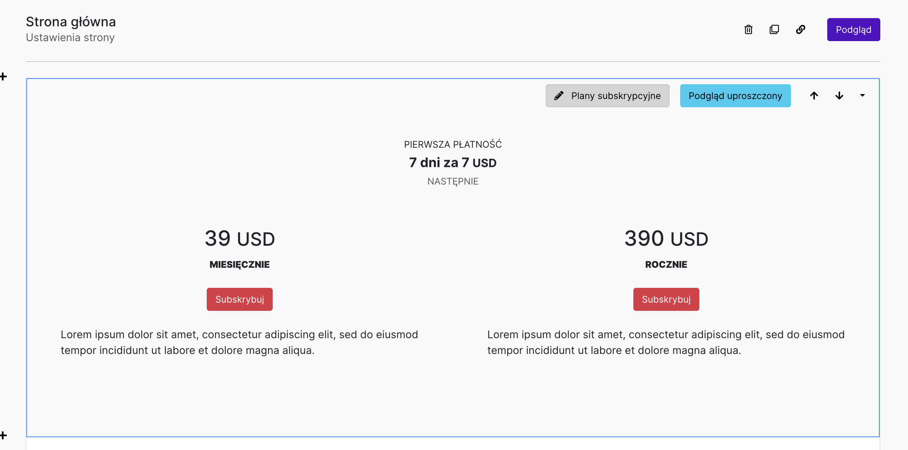

 

## Sprzedaż produktu poza subskrypcją

Jest to funkcja umożliwiająca sprzedaż kursu online poza abonamentem subskrypcyjnym. Jeśli prowadzisz platformę subskrypcją, ale chcesz sprzedać kurs, który nie powinien być dostępny dla klientów subskrypcyjnych. To jest to opcja, która Ci to umożliwi. 

Aby włączyć tą opcję należy wejść w **Edycję wybranego produktu.** 

A następnie przejść do **sekcji SZCZEGÓŁY** i zaznaczyć opcję *Produkt sprzedawany poza subskrypcją*. 

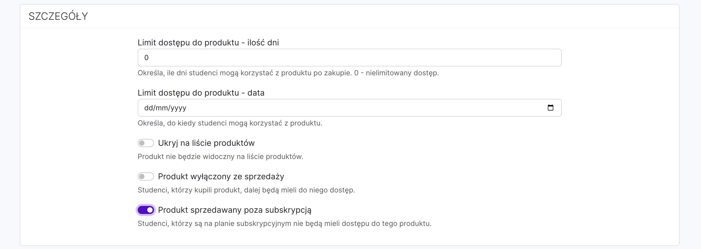

## Sprzedaż subskrypcyjna i jednorazowa

Aby włączyć jednocześnie model sprzedaży subskrypcyjnej i jednorazowej należy przejść do **Ustawienia konta -> zaznaczyć jednocześnie opcje *Jednorazowe płatności i Model subskrypcyjny*.**

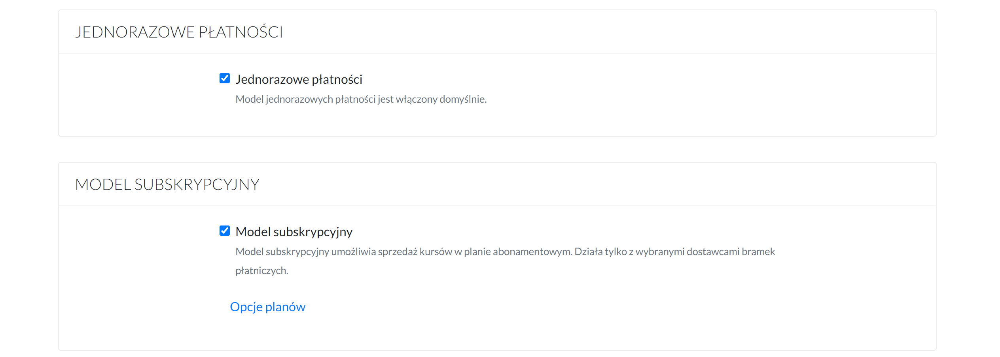

Wówczas użytkownicy będą mieli wybór czy chcą dokonać zakupu tego produktu w jednorazowej płatności czy w modelu subskrypcyjnym. 

Po dodaniu na stronie sprzedażowej komponentu Przyciski zakupowe automatycznie dodadzą się 2 przyciski - jeden umożliwiający zakup produktu w modelu jednorazowym, a drugi w modelu subskrypcyjnym. 

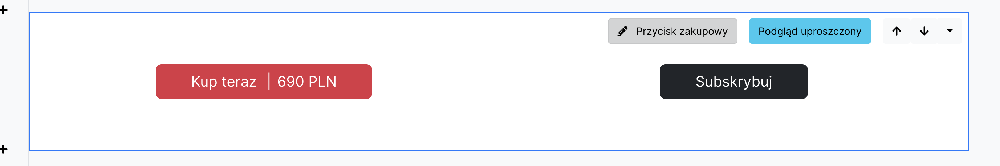

