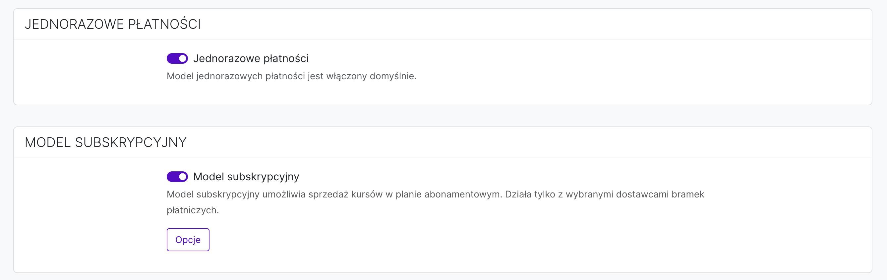
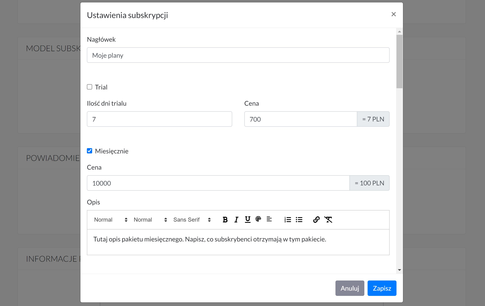

# Subskrypcje

## Sprzedaż subskrypcyjna
Aby włączyć model sprzedaży subskrypcyjnej należy przejść do **Ustawień strony -> Model pobierania płatności -> zaznaczyć opcję *Model subskrypcyjny*.**

 

## Sprzedaż subskrypcyjna i jednorazowa
Aby włączyć model sprzedaży subskrypcyjnej i jednorazowej należy przejść do **Ustawienia konta -> Model pobierania płatności -> zaznaczyć jednocześnie opcje *Jednorazowe płatności i Model subskrypcyjny*.**

 

## Plany subskrypcyjne

Aby ustawić pakiety subskrypcyjne należy przejść do **Ustawienia konta -> Model pobierania płatności -> *Model subskrypcyjny*: *Opcje planów*.**

A następnie wybrać odpowiednie **plany subskrypcyjne.**

Do dyspozycji mamy:

* **Trial** - o tym, jak działa trial znajdziesz informacje poniżej.
* **Miesięczny** - użytkownik wykupuje dostęp do platformy na miesiąc. I raz w miesiącu pobierana jest opłata z jego karty kredytowej.
* **Kwartalny** - użytkownik wykupuje dostęp do platformy na 3 miesiące. I raz na 3 miesiące pobierana jest opłata z jego karty kredytowej.
* **Półroczny** - użytkownik wykupuje dostęp na 6 miesięcy. I raz na 6 miesięcy pobierana jest opłata z jego karty kredytowej.
* **Roczny** - użytkownik wykupuje dostęp na 12 miesięcy. I raz na 12 miesięcy pobierana jest opłata z jego karty kredytowej.
* **Lifetime** - użytkownik wykupuje stały dostęp do platformy. Płaci raz i ma nieograniczony dostęp czasowy. 

Pod każdym planem można dodać opis. Opis, który będzie informował użytkownika co wchodzi w skład każdego planu. 

**Jak pokazać plany subskrypcyjne na swojej stronie?**

Aby wyświetlić oferowane plany subskrypcyjne na stronie głównej należy przejść do zakładki **Strony -> Strona główna, a następnie dodać sekcję Plany subskrypcyjne** W edytorze na podglądzie zobaczysz tzw. "podgląd uproszczony", ale już na stronie głównej podgląd rzeczywisty.

### Trial

Opcję trail włączamy, jeśli chcemy dać użytkownikowi możliwość przetestowania platformy za niższą cenę. W tym wypadku możemy ustawić ofertę, na przykład 7 dni za 7 zł. Oznacza to, że użytkownicy będą mieli dostęp do platformy na 7 dni i zostaną obciążoni kwotą 7 zł. Oczywiście można ustawić dowoloną ilość dni dostępu i dowoloną cenę. 

Co się dzieje po okresie trial?

Po okresie trail (czyli w tym wypadku po 7 dniach) użytkownicy automatycznie będą "przerzucani" na plan abonamentowy, który wybiorają przy dokonywaniu płatności. Na stronie zakupowej są informowani o tym, że kupują dostęp do platformy na 7 dni za 7 zł, a następnie zostaną obciążeni inną kwotą, w zależności od planu, który wybiorą. Jeśli w ciągu tych 7 dni anulują subskrypcję to nie zostaną obciążeni żadnymi dodatkowymi płatnościami. 

 

## Dodatkowe informacje

### Strona zakupowa (checkout) 

Istnieje możliwość wstawienia dodatkowych informacji na stronie zakupowej. Informacje te będą widoczne pod planami subskrypcyjnymi. 

Aby dodać te informacje należy wejść w Opcje planów, a następnie przejść do sekcji: Informacje dodatkowe na stronie /subscribe/checkout.

### Strona z wyborem planu

Istnieje też możliwość wstawienia dodatkowych informacji na stronie z wyborem i opisem poszczególnych planów subskrypcyjnych.

Aby dodać te informacje należy wejść w Opcje planów, a następnie przejść do sekcji: Informacje dodatkowe na stronie /subscribe.

 

## Sprzedaż kursu poza subskrypcją

Jest to funkcja umożliwiająca sprzedaż kursu online poza abonamentem subskrypcyjnym. Jeśli prowadzisz platformę subskrypcją, ale chcesz sprzedać kurs, który nie powinien być dostępny dla klientów subskrypcyjnych. To jest to opcja, która Ci to umożliwi. 

Aby włączyć tą opcję należy wejść w **Edycję kursu.** 

A następnie przejść do **sekcji SZCZEGÓŁY** i zaznaczyć opcję *Produkt sprzedawany poza subskrypcją*. 

