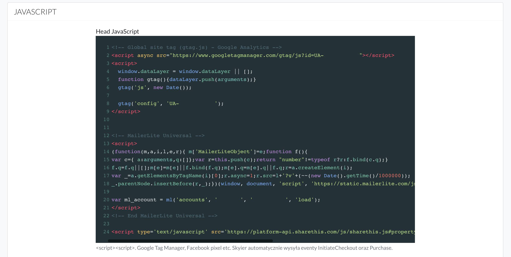

# Kody śledzące

Aby dodawać kody śledzące, typu pixel Facebook'a, Google Analytics, Google Tag Manager (lub każdy inny), należy wejść do **Ustawień strony -> Javascript**

Jest tam możliwość umieszczania kodów w sekcji **head** lub **body**, w zależności od tego, jakie są wytyczne konkretnego kodu.

Kod pixel FB i Google Analytics rekomendujemy dodanie w sekcji **head**.



**Ważne**

Jeśli dodasz Pixel FB lub kod Google Analytics wiedz, że Skyier automatycznie wysyła, takie eventy jak:

**Purchase (zakup)**. W momencie, kiedy ktoś dokona zakupu a system dostanie potwierdzenie, że zakup płatność przebiegła poprawnie. Dzięki temu od razu jest podgląd, która reklama generuje najwięcej konwersji (rzeczywistych sprzedaży).

Tutaj dane szczegółowe wysyłanego eventu:

```js
// do dataLayer wysyłane są takie dane
dataLayer.push({
  value: 'wartość transakcji',
  currency: 'waluta transakcji',
  content_name: 'subscrypcja lub slug produktu',
  content_type: 'wariant subskrypcji lub wariant produktu',
})

// do facebooka są wysyłane takie dane
fbq('track', 'Purchase', {
  value: 'wartość transakcji',
  currency: 'waluta transakcji',
  content_name: 'subscrypcja lub slug produktu',
  content_type: 'wariant subskrypcji lub wariant produktu',
})

// do google są wysyłane takie dane
// system rozpoznaje automatycznie czy na stronie jest zainstalowany ga czy gtag
ga('event', 'purchase', {
  currency: 'waluta transakcji',
  value: 'wartość transakcji',
  transaction_id: 'identyfikator transakcji',
  items: [
    {
      item_name: 'slug produktu lub subskrypcja',
      item_variant: 'tutaj wariant kursu lub wariant subskrypcji',
      price: 'wartośc jeszcze raz',
      currency: 'waluta jeszcze raz',
    },
  ],
})
```

**InitiateCheckout / begin_checkout (zainicjowanie przejścia do płatności)**. W momencie, kiedy ktoś na stronie dokonywania zakupu klinie w przycisk Kup teraz, ale z jakiś przyczyn nie dokończy zakupu. Dzięki temu można targetować użytkowników, którzy rozpoczęli, ale nie dokończyli płatności.

```js
// do facebooka są wysyłane takie dane
fbq('track', 'InitiateCheckout')

// do google są wysyłane takie dane
// system rozpoznaje automatycznie czy na stronie jest zainstalowany ga czy gtag
ga('event', 'begin_checkout')
```


**Uwagi**: Jeśli na stronie nie ma zainstalowanych skryptów od Facebooka / Google - eventy nie wysyłają się.
W przypadku korzystania z innych narzędzi analiycznych - dane konwersji można pobrać z dataLayer.