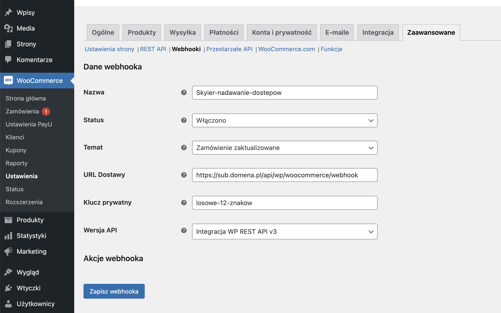

# Integracja z Woocommerce

## Ustawienia w Woocommerce

Zaloguj się do swojego do WordPress'a.

Przejdź do: **WooCommerce -> Ustawienia -> Zaawansowane -> Webhooki**

Kliknij **"Dodaj Webhook"**

Wprowadź ustawienia.

* **Nazwa:** podaj nazwę, abyś wiedział do czego został stworzony ten Webhook
* **Status:** ustaw Włączono
* **Temat:** ustaw Zamówienie zaktualizowane
* **Url Dostawy:** podaj https://subdomena.domena.pl/api/wp/woocommerce/webhook. 
Przykład: adres url, pod jakim prowadzisz platformę to: https://kursy.jankowalski.pl, zatem Twój Url Dostawy to: https://kursy.jankowalski.pl/api/wp/woocommerce/webhook.
* **Klucz prywatny:** ustal swój 12-cyfrowy klucz bezpieczeństwa
* **Wersja Api:** ustaw Integracja WP Rest API v3
* **Zapisz Webhooka**

## Ustawienia w Skyier

Zaloguj się do Skyier

Wybierz: **Integracje (w prawym górnym rogu przy imieniu jest strzałka, którą trzeba kliknąć) -> Dodaj -> WooCommerce**

Wpisz **12-cyfrowy klucz** ustawiony wcześniej w WooCommerce

**Kliknij Zapisz**

**WAŻNE** Aby integracja zadziałała poprawnie należy pamiętać o tym, aby nazwy kursów podawane w Produktach na WP były identyczne z nazwami produktów wprowadzonych w Skyier. Bo właśnie na podstawie tytułów jest nadawana dostępność (nazwy kursów stanowi tutaj "punkt połączenia").